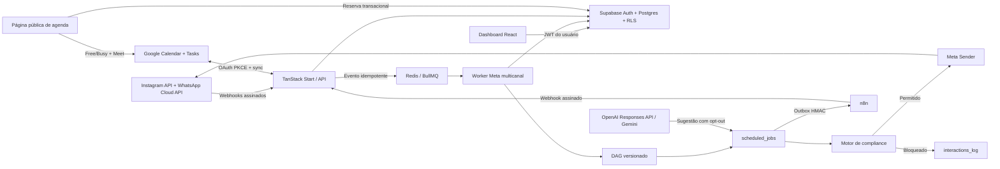

# Wal Chat

Plataforma multi-tenant de automação, atendimento, conteúdo e relacionamento para Instagram Professional e WhatsApp Business. O Wal Chat foi desenhado para creators e negócios brasileiros, com interface em PT-BR, proteção centralizada das regras de mensageria da Meta e operação isolada por workspace.


## Estado do projeto

| Item                   | Estado                                                                      |
| ---------------------- | --------------------------------------------------------------------------- |
| MVP navegável          | Disponível                                                                  |
| Homologação HTTPS      | [wal-chat.64.181.178.125.nip.io](https://wal-chat.64.181.178.125.nip.io)    |
| Auth, Postgres e RLS   | Supabase isolado                                                            |
| Filas e workers        | Redis + BullMQ                                                              |
| Webhooks Meta          | Instagram + WhatsApp com HMAC, idempotência, Inbox e worker                 |
| Segurança de entrega   | Claim persistente; resposta ambígua não é reenviada automaticamente         |
| Hardening do backend   | JWT + RLS, ingestão transacional, SKIP LOCKED e limites distribuídos        |
| Motor de automações    | DAG visual com botões, pergunta validada, requisição externa e simulador    |
| Reconciliação da fila  | Postgres/BullMQ por `jobId` canônico                                        |
| OAuth Instagram        | Login, token cifrado por tenant, assinatura e validação implementados       |
| WhatsApp Cloud API     | Embedded Signup, WABA, telefone, templates e receipts implementados         |
| OpenAI / Gemini        | Responses API + Gemini opcional, configuráveis por workspace                |
| Google Workspace       | OAuth PKCE, Calendar, Meet, Tasks, Free/Busy e links públicos implementados |
| Integração n8n         | Gateway, comandos CRM/automação, health, HMAC e idempotência                |
| Site público e SEO     | 404, CTA, FAQ, provas técnicas, sitemap, robots, OG e JSON-LD               |
| LGPD e Analytics       | Pedido de exclusão persistido e GA4 bloqueado até consentimento             |
| Modo atual da produção | `DEMO_MODE=false`; kill switches do workspace desligados                    |
| Live Mode Meta         | API real validada; envio canário depende da conta remetente correta         |

> A release live está implantada e as leituras reais da Instagram API foram
> aprovadas. A entrega externa continua protegida pelos kill switches do
> workspace até conectar `_fat.tech` e definir o destinatário do canário.

## O que o sistema entrega

- Dashboard real de DMs, comentários, canais e novos contatos; alcance usa `insights_daily`.
- Inbox unificada com Principal, Geral, Pedidos e IA off.
- CRM de Contatos & Tags com perfil 360º, contatos manuais, filtros, score,
  estágio, responsável, campos personalizados, notas fixáveis, auditoria, ações
  em lote, elegibilidade e CSV.
- Gatilhos por comentário, DM, resposta de story ou mensagem do WhatsApp.
- Embedded Signup do WhatsApp, registro do telefone, sincronização de templates e mídia autenticada.
- Automation Studio v2: editor visual ligado ao DAG versionado com mensagem e
  mídia, botões de resposta, pergunta com validação, agente de IA, requisição
  externa com mapeamento, ação de CRM, condição, delay, A/B determinístico,
  handoff humano, evento n8n confirmado, subfluxo e trilha de execução.
- Conversa com botões nos dois canais: o fluxo guarda uma lista única de
  escolhas e cada canal recebe a forma nativa — respostas rápidas no Instagram,
  botões até três opções e lista a partir da quarta no WhatsApp.
- Teste de jornada sem publicar e sem enviar nada, com o texto exato que sairia.
- Quatro jornadas prontas em PT-BR para clonar em um clique.
- Agentes de IA em modo copiloto ou autônomo.
- Reengajamento com preview de elegibilidade, persistência, início,
  pausa/cancelamento e vazão configurável de 30–45/min, protegido pelo gate de
  produção.
- Calendário operacional com mês/semana/agenda, CRUD, Google Calendar/Tasks,
  Meet, Free/Busy, links públicos e atividade dos demais módulos.
- Estúdio persistente de Feed, Reels, Story e Carrossel, com agendamento,
  containers oficiais e publicação pelo scheduler, protegido pelo gate externo.
- Preferências de auto-like são configuráveis, mas a execução permanece
  explicitamente indisponível porque a API oficial não oferece curtida de
  comentários.
- Insights com sincronização oficial resiliente, métricas diárias e por post.
- Política de Privacidade, Termos e Exclusão de Dados.
- Central de Go-Live com diagnóstico, kill switches e observabilidade de webhooks.
- Comment-to-DM por publicação real e Inbox com atribuição, prioridade e notas.
- Copiloto com recuperação de conhecimento e indicação das fontes usadas.
- Manual HTML pesquisável de acessos, configuração, operação e Go-Live.
- Wizard de integrações com diagnóstico de Meta, WhatsApp, Google, IA e n8n.
- Ponte n8n bidirecional com eventos automáticos e ações inbound controladas.
- Landing pública com CTA acima da dobra e fixo no mobile, links internos,
  casos de uso tecnicamente validados, avaliações verificadas, FAQ, promessa de
  resposta, localização configurável, 404 e página de obrigado.
- SEO técnico com metadados únicos nas páginas públicas, canonical, Open Graph,
  sitemap, robots e schema Organization/SoftwareApplication. LocalBusiness só é
  emitido depois que um endereço verdadeiro é configurado.

## Arquitetura



O backend recebe o corpo bruto do webhook, valida `X-Hub-Signature-256`, persiste uma chave idempotente e enfileira o processamento. O worker normaliza contatos e interações; o scheduler executa sequências e chama o motor de compliance imediatamente antes de qualquer envio. DMs recebem um claim persistente antes da chamada externa; timeout ou resposta ambígua vira estado `unknown` e não dispara retry automático.

A revisão de segurança mais recente está documentada em [Auditoria de segurança — 25/08/2026](docs/AUDITORIA_SEGURANCA_2026-08-25.md); a anterior, focada no núcleo do backend, está em [Auditoria do backend core — 20/08/2026](docs/AUDITORIA_BACKEND_CORE_2026-08-20.md).

O desenho e o runbook do novo motor estão em
[Arquitetura do backend e automações DAG — 22/08/2026](docs/ARQUITETURA_BACKEND_AUTOMACOES_DAG_2026-08-22.md).

O manual operacional da interface e dos blocos v2 está em
[Automation Studio v2 — 24/08/2026](docs/AUTOMATION_STUDIO_V2_2026-08-24.md).

A auditoria transversal desta release está em
[Auditoria de pré-produção, segurança, funções e SEO — 20/08/2026](docs/AUDITORIA_PRE_PRODUCAO_SEGURANCA_SEO_2026-08-20.md).

Leia [Arquitetura](docs/ARQUITETURA.md) para os limites dos componentes, fluxos de falha e decisões técnicas.

## Regras de compliance aplicadas no código

Todo envio passa por `src/server/compliance.ts`:

- janela padrão de 24 horas após a última interação recebida;
- `HUMAN_AGENT` somente para atendimento humano e até sete dias;
- bloqueio de automação quando o contato respondeu `PARAR`;
- rodapé obrigatório `Responda PARAR` em mensagens automáticas;
- cooldown padrão de 24 horas por contato e gatilho;
- uma única Private Reply por comentário;
- blocklist configurável;
- revalidação de elegibilidade no momento do envio;
- registro da decisão, política e motivo de bloqueio.
- claim idempotente por envio e bloqueio de replay ambíguo.

Detalhes e checklist de auditoria: [Segurança e compliance](docs/SEGURANCA_E_COMPLIANCE.md).

## Stack

| Camada             | Tecnologia                                        |
| ------------------ | ------------------------------------------------- |
| Frontend/SSR       | React 19, TanStack Start, TanStack Router, Vite 8 |
| Interface          | CSS próprio, Recharts, Lucide, dnd-kit            |
| Banco/Auth/Storage | Supabase/PostgreSQL                               |
| Fila               | Redis 7.4 + BullMQ                                |
| IA                 | OpenAI Responses API + AI SDK/Gemini opcional     |
| Validação          | Zod                                               |
| Testes             | Vitest + smoke test integrado                     |
| Produção           | Docker Compose, Nginx, Let's Encrypt              |

## Estrutura do repositório

```text
WalChat/
├── src/
│   ├── components/              # shell, componentes compartilhados e páginas legais
│   ├── contexts/                # sessão e autenticação
│   ├── lib/                     # cliente Supabase e dados de demonstração
│   ├── routes/                  # telas e endpoints file-based
│   ├── server/                  # compliance, Meta, IA, filas e processamento
│   └── workers/                 # consumidores BullMQ e scheduler
├── supabase/
│   ├── migrations/              # schema, RLS, GRANTs, views e triggers
│   ├── config.toml              # Supabase local
│   └── seed.sql                 # dados de desenvolvimento
├── scripts/                     # servidor de produção, smoke e validações
├── deploy/                      # preparação do Supabase e Nginx
├── docs/                        # documentação técnica e operacional
├── output/pdf/                  # manual operacional renderizado
├── docker-compose.yml           # Redis de desenvolvimento
└── docker-compose.production.yml# stack isolada de produção
```

O inventário arquivo a arquivo está em [Mapa do código](docs/MAPA_DO_CODIGO.md).

## Requisitos locais

- WSL 2 ou Linux;
- Node.js 22 ou superior;
- npm 10 ou superior;
- Docker Engine com Compose;
- Supabase CLI — já incluído nas dependências de desenvolvimento.

## Início rápido no WSL

```bash
gh repo clone ShunWalChin/WalChat
cd WalChat
npm ci
npm run local:up
npx supabase status -o env
cp .env.example .env.local
```

Copie a `PUBLISHABLE_KEY` para `VITE_SUPABASE_ANON_KEY` e `SUPABASE_PUBLISHABLE_KEY`; copie a `SECRET_KEY` para `SUPABASE_SERVICE_ROLE_KEY` em `.env.local`. Depois execute:

```bash
npm run db:reset
npm run dev:all
```

Serviços locais:

| Serviço         | Endereço                 |
| --------------- | ------------------------ |
| Aplicação       | `http://localhost:3001`  |
| Supabase API    | `http://127.0.0.1:54321` |
| Supabase Studio | `http://127.0.0.1:54323` |
| Mailpit         | `http://127.0.0.1:54324` |
| Redis           | `redis://127.0.0.1:6380` |

Conta local criada pelo seed:

```text
email: demo@walchat.local
senha: wal123
```

Essa credencial existe apenas para desenvolvimento. Nunca reutilize a senha local em produção.

## Variáveis de ambiente

| Variável                                  | Exposição | Finalidade                                |
| ----------------------------------------- | --------- | ----------------------------------------- |
| `VITE_SUPABASE_URL`                       | Pública   | URL usada pelo cliente web                |
| `VITE_SUPABASE_ANON_KEY`                  | Pública   | Chave publishable do Supabase             |
| `VITE_PUBLIC_SITE_URL`                    | Pública   | Origem canonical usada em SEO             |
| `VITE_PUBLIC_SUPPORT_EMAIL`               | Pública   | Contato legal e operacional               |
| `VITE_PUBLIC_RESPONSE_SLA`                | Pública   | Promessa pública de tempo de resposta     |
| `VITE_GA_MEASUREMENT_ID`                  | Pública   | ID GA4; tag depende de consentimento      |
| `VITE_PUBLIC_BUSINESS_ADDRESS`            | Pública   | Endereço real para mapa e LocalBusiness   |
| `VITE_PUBLIC_BUSINESS_HOURS`              | Pública   | Horários reais no schema                  |
| `VITE_PUBLIC_GOOGLE_MAPS_URL`             | Pública   | Link de rota no Google Maps               |
| `VITE_PUBLIC_GOOGLE_MAPS_EMBED_URL`       | Pública   | Mapa incorporado                          |
| `SUPABASE_URL`                            | Backend   | URL interna do Supabase                   |
| `SUPABASE_SERVICE_ROLE_KEY`               | Secreta   | Acesso administrativo dos workers         |
| `SUPABASE_PUBLISHABLE_KEY`                | Backend   | Cliente server-side sujeito a RLS         |
| `REDIS_URL`                               | Backend   | Conexão BullMQ                            |
| `META_INSTAGRAM_APP_ID`                   | Backend   | App ID próprio do Instagram Login         |
| `META_INSTAGRAM_APP_SECRET`               | Secreta   | OAuth e HMAC dos webhooks do Instagram    |
| `META_INSTAGRAM_VERIFY_TOKEN`             | Secreta   | Challenge do webhook Instagram            |
| `META_WHATSAPP_APP_ID`                    | Backend   | App ID principal do WhatsApp/Facebook     |
| `META_WHATSAPP_APP_SECRET`                | Secreta   | OAuth, proof e HMAC do WhatsApp           |
| `META_WHATSAPP_VERIFY_TOKEN`              | Secreta   | Challenge do webhook WhatsApp             |
| `META_APP_ID`                             | Legada    | Fallback durante migração                 |
| `META_APP_SECRET`                         | Legada    | Fallback durante migração                 |
| `META_ACCESS_TOKEN`                       | Secreta   | Mensageria e leitura da Graph API         |
| `META_PUBLISH_TOKEN`                      | Secreta   | Publicação de conteúdo                    |
| `META_VERIFY_TOKEN`                       | Legada    | Fallback de challenge                     |
| `META_OAUTH_REDIRECT_URI`                 | Backend   | Redirect exato do Instagram Login         |
| `META_WHATSAPP_EMBEDDED_SIGNUP_CONFIG_ID` | Backend   | Configuração publicada do Embedded Signup |
| `META_GRAPH_VERSION`                      | Backend   | Versão da Graph API, como `v25.0`         |
| `CREDENTIALS_ENCRYPTION_KEY`              | Secreta   | AES-256-GCM de tokens por tenant          |
| `OPENAI_API_KEY`                          | Secreta   | Responses API                             |
| `OPENAI_MODEL`                            | Backend   | Modelo OpenAI padrão                      |
| `OPENAI_PROJECT`                          | Secreta   | Projeto OpenAI opcional                   |
| `OPENAI_ORGANIZATION`                     | Secreta   | Organização OpenAI opcional               |
| `GOOGLE_GENERATIVE_AI_API_KEY`            | Secreta   | Gemini 2.5 Flash                          |
| `GOOGLE_CLIENT_ID`                        | Backend   | OAuth Web Client do Google Workspace      |
| `GOOGLE_CLIENT_SECRET`                    | Secreta   | Segredo do OAuth Google                   |
| `GOOGLE_OAUTH_REDIRECT_URI`               | Backend   | Callback exato do Google                  |
| `APP_ORIGIN`                              | Backend   | Origem pública da aplicação               |
| `DEMO_MODE`                               | Backend   | Impede efeitos externos quando `true`     |
| `TRUSTED_CLIENT_IP_HEADER`                | Backend   | Header de IP da CDN, quando houver uma    |

Variáveis `VITE_PUBLIC_*`, a chave publishable do Supabase e o ID público GA4
podem chegar ao navegador. Nunca adicione o prefixo `VITE_` a tokens Meta,
chaves administrativas ou credenciais de IA.

## Comandos

| Comando                   | Função                                     |
| ------------------------- | ------------------------------------------ |
| `npm run dev`             | Inicia apenas a aplicação                  |
| `npm run dev:all`         | Inicia aplicação e dois workers            |
| `npm run local:up`        | Inicia Supabase e Redis locais             |
| `npm run local:status`    | Mostra o estado local                      |
| `npm run local:down`      | Para os serviços locais                    |
| `npm run db:reset`        | Reaplica migrations e seed                 |
| `npm run db:lint`         | Valida o schema PostgreSQL                 |
| `npm test`                | Executa testes unitários                   |
| `npm run lint`            | Executa ESLint                             |
| `npx tsc --noEmit`        | Verifica tipos                             |
| `npm run build`           | Gera os bundles cliente e SSR              |
| `npm run validate:routes` | Confirma rotas, 404, SEO, robots e sitemap |
| `npm run audit:system`    | Audita auth, origem, body limits e SEO     |
| `npm run smoke`           | Valida Auth, RLS, webhook, fila e workers  |
| `npm audit --omit=dev`    | Audita apenas dependências de produção     |
| `npm run prod:up`         | Constrói e sobe a stack de produção        |
| `npm run prod:logs`       | Acompanha logs da stack                    |

## API e webhook

| Método      | Endpoint                                     | Responsabilidade                               |
| ----------- | -------------------------------------------- | ---------------------------------------------- |
| `GET`       | `/api/health`                                | Liveness do processo, sem sondar dependências  |
| `GET`       | `/api/ready`                                 | Readiness real de Supabase e Redis             |
| `GET/POST`  | `/api/public/webhooks/instagram`             | Challenge, HMAC e fila Meta                    |
| `GET/POST`  | `/api/public/webhooks/whatsapp`              | Challenge, HMAC e fila WhatsApp                |
| `POST`      | `/api/integrations/meta/start`               | Início OAuth com state de uso único            |
| `GET`       | `/api/integrations/meta/status`              | Estado sanitizado da conexão                   |
| `GET`       | `/api/integrations/meta/callback`            | Code exchange e token cifrado                  |
| `POST`      | `/api/integrations/meta/validate`            | Revalidação de perfil, token e webhooks        |
| `DELETE`    | `/api/integrations/meta/disconnect`          | Desassinatura e remoção da credencial          |
| `POST`      | `/api/integrations/meta/whatsapp/complete`   | Finaliza Embedded Signup e assina a WABA       |
| `POST`      | `/api/integrations/meta/whatsapp/validate`   | Revalida token, WABA, telefone e webhook       |
| `GET/POST`  | `/api/integrations/meta/whatsapp/templates`  | Lista e sincroniza templates oficiais          |
| `POST`      | `/api/integrations/meta/whatsapp/register`   | Registra telefone com PIN efêmero              |
| `GET/PUT`   | `/api/ai/settings`                           | Provedor, modelo e chave cifrada               |
| `GET/*`     | `/api/ai/agents`, `/api/ai/knowledge`        | CRUD autenticado de agentes e conhecimento     |
| `POST`      | `/api/ai/suggest`                            | Playground/sugestão a partir do agente salvo   |
| `GET/PATCH` | `/api/operations/go-live`                    | Diagnóstico e kill switches do workspace       |
| `GET/POST`  | `/api/operations/webhooks`                   | Observabilidade e replay seguro de falhas      |
| `GET/POST`  | `/api/integrations/meta/media`               | Cache e sincronização de publicações reais     |
| `GET/PATCH` | `/api/inbox`                                 | Conversas reais, mensagens, leitura e IA       |
| `GET`       | `/api/contacts`                              | CRM multicanal e elegibilidade                 |
| `GET`       | `/api/dashboard`                             | Métricas operacionais reais                    |
| `GET/*`     | `/api/triggers`                              | CRUD de gatilhos simples persistidos           |
| `GET/POST`  | `/api/automations`                           | Catálogo e criação de jornadas DAG             |
| `GET/PATCH` | `/api/automations/:flowId`                   | Rascunho, revisão otimista e observabilidade   |
| `POST`      | `/api/automations/:flowId`                   | Publicação atômica de versão imutável          |
| `POST`      | `/api/automations/:flowId/execute`           | Execução manual idempotente e Meta-safe        |
| `GET`       | `/api/workspaces`                            | Workspaces do usuário para o seletor de tenant |
| `GET/*`     | `/api/automations/fields`                    | Campos de contato e globais tipados            |
| `GET/*`     | `/api/calendar`                              | Agenda unificada e CRUD de eventos/tarefas     |
| `GET/*`     | `/api/calendar/booking-pages`                | Tipos e links públicos de agendamento          |
| `GET/POST`  | `/api/public/bookings/:slug`                 | Free/Busy e reserva pública transacional       |
| `POST/GET`  | `/api/integrations/google/start`, `callback` | OAuth Google com state, PKCE e token cifrado   |
| `GET/PATCH` | `/api/integrations/google/status`            | Seleção de calendário e lista do Tasks         |
| `POST`      | `/api/integrations/google/sync`              | Sync incremental Calendar e Tasks              |
| `GET/PUT`   | `/api/integrations/n8n/status`, `configure`  | Wizard e credenciais cifradas do n8n           |
| `POST`      | `/api/integrations/n8n/test`, `events`       | Teste e despacho idempotente de eventos        |
| `DELETE`    | `/api/integrations/n8n/disconnect`           | Remove conexão e secrets do workspace          |
| `POST`      | `/api/public/webhooks/n8n/:connectionId`     | HMAC, anti-replay e ações inbound controladas  |
| `POST`      | `/api/messages/send`                         | Envio humano com compliance                    |
| `POST`      | `/api/compliance/check`                      | Decisão pura de elegibilidade                  |
| `POST`      | `/api/data-deletion`                         | Signed request de exclusão da Meta             |
| `GET/POST`  | `/api/privacy/deletion-requests`             | Protocolo LGPD público e consulta de status    |
| `GET`       | `/api/public/reviews`                        | Avaliações verificadas e consentidas           |

Contratos, respostas e códigos HTTP: [API e webhooks](docs/API_E_WEBHOOKS.md).

Configuração, payloads e operação do n8n: [Integração n8n](docs/INTEGRACAO_N8N.md).

Suíte implantada e runbook: [Workflows n8n operacionais](docs/WORKFLOWS_N8N_OPERACIONAIS_2026-08-24.md).
O escopo comparado com o produto de referência está em
[Paridade Wal Chat × ManyChat — 25/08/2026](docs/PARIDADE_MANYCHAT_2026-08-25.md).
As evidências desta release estão no
[Relatório de validação do n8n](docs/RELATORIO_VALIDACAO_N8N_2026-08-23.md).

## Banco e multi-tenancy

O tenant é um `workspace`. Toda entidade operacional carrega `workspace_id`, e as policies chamam funções `SECURITY DEFINER` para validar associação e papel. Tokens Meta e chaves de IA são cifrados em `integration_credentials`, tabela revogada para `anon/authenticated` e acessada apenas pela service role.

Papéis disponíveis:

- `owner`: titular e responsável pelo workspace;
- `admin`: integrações, usuários e automações;
- `agent`: Inbox, contatos e conteúdo;
- `viewer`: leitura de métricas e relatórios.

Veja tabelas, relacionamentos, views, índices, RLS e GRANTs em [Banco de dados](docs/BANCO_DE_DADOS.md).

## Testes obrigatórios antes de publicar

```bash
npm test
npm run lint
npx tsc --noEmit
npm run build
npm run audit:system
npm run db:lint
npm audit --omit=dev
```

Com a aplicação, Redis, workers e Supabase ativos:

```bash
npm run validate:routes
npm run smoke
```

O smoke test cria um evento Meta assinado, confirma a rejeição de assinatura inválida, verifica isolamento RLS, acompanha BullMQ, worker e scheduler, e falha imediatamente quando uma etapa obrigatória não responde.

## Implantação

A homologação usa:

- aplicação em `127.0.0.1:4194`;
- Supabase isolado `wal_chat_prod` nas portas `54351–54359`;
- rede e volume Redis `wal-chat-*`;
- Nginx como único ponto de entrada público;
- HTTPS automático pelo Certbot.

O Supabase CLI dessa homologação é apenas um ambiente temporário de testes. Produção real exige um projeto Supabase gerenciado ou a distribuição oficial self-hosted, com backup, atualização, SMTP e observabilidade próprios. Os processos Node acessam o gateway da instância isolada pela rede Docker privada `supabase_network_wal_chat_prod`, usando o alias `api.supabase.internal`.

O procedimento completo, configuração das contas Meta/OpenAI e rotina de operação estão em:

- [Manual interno de implementação e operação](docs/MANUAL_INTERNO_IMPLEMENTACAO_E_OPERACAO.md)
- [Configuração real da Meta e OpenAI](docs/CONFIGURACAO_META_E_OPENAI.md)
- [Configuração do Google Calendar, Meet e Tasks](docs/CONFIGURACAO_GOOGLE_CALENDAR.md)
- [Manual em PDF](output/pdf/manual-interno-wal-chat.pdf)
- [Relatório de homologação](docs/RELATORIO_VALIDACAO_HOMOLOGACAO.md)
- [Validação Meta em produção — 24/08/2026](docs/VALIDACAO_META_PRODUCAO_2026-08-24.md)
- [Validação dos módulos de produção — 24/08/2026](docs/VALIDACAO_MODULOS_PRODUCAO_2026-08-24.md)
- [Backup completo e ativação live — 24/08/2026](docs/ATIVACAO_LIVE_E_BACKUP_2026-08-24.md)
- [Deploy 25/08/2026 — paridade e hardening](docs/DEPLOY_2026-08-25_MANYCHAT_E_SEGURANCA.md)

## Documentação

| Documento                                                                               | Conteúdo                                           |
| --------------------------------------------------------------------------------------- | -------------------------------------------------- |
| [Arquitetura](docs/ARQUITETURA.md)                                                      | Componentes, fluxos, isolamento e decisões         |
| [API e webhooks](docs/API_E_WEBHOOKS.md)                                                | Contratos HTTP e eventos Meta                      |
| [Banco de dados](docs/BANCO_DE_DADOS.md)                                                | Tabelas, RLS, GRANTs, views e jobs                 |
| [Segurança e compliance](docs/SEGURANCA_E_COMPLIANCE.md)                                | Regras Meta, secrets e controles                   |
| [Configuração Meta e OpenAI](docs/CONFIGURACAO_META_E_OPENAI.md)                        | Onboarding e testes com contas reais               |
| [Google Calendar, Meet e Tasks](docs/CONFIGURACAO_GOOGLE_CALENDAR.md)                   | OAuth, agenda pública, sync e homologação          |
| [Validação do Calendário](docs/VALIDACAO_CALENDARIO_OPERACIONAL_2026-08-20.md)          | Evidências locais e checklist da conta piloto      |
| [Instagram + WhatsApp Business](docs/INTEGRACOES_META_INSTAGRAM_WHATSAPP.md)            | Setup completo, callbacks, testes e operação       |
| [Mapa do código](docs/MAPA_DO_CODIGO.md)                                                | Responsabilidade de cada arquivo                   |
| [Guia de desenvolvimento](docs/GUIA_DE_DESENVOLVIMENTO.md)                              | Convenções, testes e extensão do produto           |
| [Plano de produção](docs/PLANO_DE_PRODUCAO.md)                                          | Gates, riscos e sequência segura de go-live        |
| [Validação de produção real V1](docs/VALIDACAO_PRODUCAO_REAL_V1.md)                     | Escopo, evidências e aprovação do piloto           |
| [Atualização operacional V1](docs/ATUALIZACAO_OPERACIONAL_V1.md)                        | Go-Live, gateway, Inbox, Comment-to-DM e RAG       |
| [Auditoria técnica 30/07](docs/AUDITORIA_TECNICA_2026-07-30.md)                         | Achados priorizados e parecer de promoção          |
| [Auditoria de segurança 25/08](docs/AUDITORIA_SEGURANCA_2026-08-25.md)                  | Rate limit, SSRF, exposição pública e CI           |
| [Auditoria pré-produção e SEO](docs/AUDITORIA_PRE_PRODUCAO_SEGURANCA_SEO_2026-08-20.md) | Funções, segurança, SEO, evidências e pendências   |
| [Manual operacional](docs/MANUAL_INTERNO_IMPLEMENTACAO_E_OPERACAO.md)                   | Implantação e contas reais                         |
| [Manual completo de acessos](docs/MANUAL_COMPLETO_ACESSOS_OPERACAO_CONFIGURACAO.md)     | URLs, usuários, módulos e configuração             |
| [Relatório de homologação](docs/RELATORIO_VALIDACAO_HOMOLOGACAO.md)                     | Evidências da validação publicada                  |
| [Validação do wizard e n8n](docs/RELATORIO_VALIDACAO_N8N_2026-08-23.md)                 | Testes, migration dry-run e gate de deploy         |
| [Validação Meta em produção](docs/VALIDACAO_META_PRODUCAO_2026-08-24.md)                | Instagram real, WhatsApp e gates de live mode      |
| [Validação dos módulos de produção](docs/VALIDACAO_MODULOS_PRODUCAO_2026-08-24.md)      | Release, testes, botões, integrações e decisão     |
| [Backup e ativação live](docs/ATIVACAO_LIVE_E_BACKUP_2026-08-24.md)                     | Backup, promoção, testes reais e rollback          |
| [Deploy 25/08 — paridade e hardening](docs/DEPLOY_2026-08-25_MANYCHAT_E_SEGURANCA.md)   | Migration ensaiada, Nginx e evidências em produção |

## Limites conhecidos do MVP

- Alcance editorial e publicação dependem do ativo e das permissões concedidas
  pela Instagram API; o backend de sincronização e publicação está implementado.
- A credencial Instagram ativa ainda pertence a `@walfredonetto`; `_fat.tech`
  precisa concluir OAuth antes do canário pretendido. O WhatsApp Embedded
  Signup está configurado, mas ainda não há WABA/número real conectado.
- Calendar/Meet/Tasks funcionam localmente; efeitos no Google dependem do OAuth
  Client, APIs habilitadas e consentimento do usuário. Sem credenciais, a UI
  informa a pendência e mantém a agenda local.
- O endpoint de exclusão valida o signed request, remove dados Instagram/WhatsApp em transação e devolve um protocolo consultável.
- SMTP de produção é necessário para confirmação de e-mail e recuperação de senha.
- Rate limiting por rota está versionado no Nginx; a validação no domínio final e o monitoramento/alertas seguem obrigatórios antes de tráfego em escala.
- Usuários com mais de um workspace escolhem o tenant no seletor da barra
  lateral; a escolha persiste no navegador e acompanha toda chamada privada no
  header `X-Workspace-Id`.

## Licença

Distribuído sob a licença MIT. Consulte [LICENSE](LICENSE).
