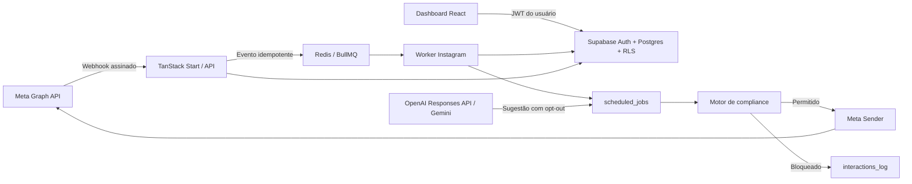

# Wal Chat

Plataforma multi-tenant de automação, atendimento, conteúdo e relacionamento para contas profissionais do Instagram. O Wal Chat foi desenhado para creators e negócios brasileiros, com interface em PT-BR, proteção centralizada das regras de mensageria da Meta e operação isolada por workspace.


## Estado do projeto

| Item                      | Estado                                                                   |
| ------------------------- | ------------------------------------------------------------------------ |
| MVP navegável             | Disponível                                                               |
| Homologação HTTPS         | [wal-chat.64.181.178.125.nip.io](https://wal-chat.64.181.178.125.nip.io) |
| Auth, Postgres e RLS      | Supabase isolado                                                         |
| Filas e workers           | Redis + BullMQ                                                           |
| Webhook Meta              | HMAC, idempotência, inbox e worker implementados                         |
| OAuth Instagram           | Login, token cifrado por tenant, assinatura e validação implementados    |
| OpenAI / Gemini           | Responses API + Gemini opcional, configuráveis por workspace             |
| Modo atual da homologação | `DEMO_MODE=true`                                                         |
| Live Mode Meta            | Depende de app, tokens, permissões e revisão da Meta                     |

> OAuth, mensageria e IA estão preparados para teste integrado. A entrega real depende de credenciais Meta/OpenAI, conta Professional de teste e permissões concedidas; publicação e Insights ainda mantêm partes demonstrativas.

## O que o sistema entrega

- Dashboard de alcance, DMs, comentários e novos contatos.
- Inbox unificada com Principal, Geral, Pedidos e IA off.
- Contatos, tags, elegibilidade de mensageria e exportação CSV.
- Gatilhos por comentário, DM ou resposta de story.
- Sequências com texto, mídia, typing e delays.
- Agentes de IA em modo copiloto ou autônomo.
- Reengajamento com filtro de elegibilidade e limite de taxa.
- Calendário editorial com visão mensal/semanal.
- Criação de Feed, Reels, Story e Carrossel.
- Auto-like por regra, sentimento ou palavra-chave.
- Insights, heatmap, top posts e análise em PT-BR.
- Política de Privacidade, Termos e Exclusão de Dados.

## Arquitetura



O backend recebe o corpo bruto do webhook, valida `X-Hub-Signature-256`, persiste uma chave idempotente e enfileira o processamento. O worker normaliza contatos e interações; o scheduler executa sequências e chama o motor de compliance imediatamente antes de qualquer envio.

Leia [Arquitetura](docs/ARQUITETURA.md) para os limites dos componentes, fluxos de falha e decisões técnicas.

## Regras de compliance aplicadas no código

Todo envio passa por `src/server/compliance.ts`:

- janela padrão de 24 horas após a última interação recebida;
- `HUMAN_AGENT` somente para atendimento humano e até sete dias;
- bloqueio de automação quando o contato respondeu `PARAR`;
- rodapé obrigatório `Responda PARAR` em mensagens automáticas;
- cooldown padrão de 24 horas por contato e gatilho;
- uma única Private Reply por comentário;
- blocklist configurável;
- revalidação de elegibilidade no momento do envio;
- registro da decisão, política e motivo de bloqueio.

Detalhes e checklist de auditoria: [Segurança e compliance](docs/SEGURANCA_E_COMPLIANCE.md).

## Stack

| Camada             | Tecnologia                                        |
| ------------------ | ------------------------------------------------- |
| Frontend/SSR       | React 19, TanStack Start, TanStack Router, Vite 8 |
| Interface          | CSS próprio, Recharts, Lucide, dnd-kit            |
| Banco/Auth/Storage | Supabase/PostgreSQL                               |
| Fila               | Redis 7.4 + BullMQ                                |
| IA                 | OpenAI Responses API + AI SDK/Gemini opcional     |
| Validação          | Zod                                               |
| Testes             | Vitest + smoke test integrado                     |
| Produção           | Docker Compose, Nginx, Let's Encrypt              |

## Estrutura do repositório

```text
WalChat/
├── src/
│   ├── components/              # shell, componentes compartilhados e páginas legais
│   ├── contexts/                # sessão e autenticação
│   ├── lib/                     # cliente Supabase e dados de demonstração
│   ├── routes/                  # telas e endpoints file-based
│   ├── server/                  # compliance, Meta, IA, filas e processamento
│   └── workers/                 # consumidores BullMQ e scheduler
├── supabase/
│   ├── migrations/              # schema, RLS, GRANTs, views e triggers
│   ├── config.toml              # Supabase local
│   └── seed.sql                 # dados de desenvolvimento
├── scripts/                     # servidor de produção, smoke e validações
├── deploy/                      # preparação do Supabase e Nginx
├── docs/                        # documentação técnica e operacional
├── output/pdf/                  # manual operacional renderizado
├── docker-compose.yml           # Redis de desenvolvimento
└── docker-compose.production.yml# stack isolada de produção
```

O inventário arquivo a arquivo está em [Mapa do código](docs/MAPA_DO_CODIGO.md).

## Requisitos locais

- WSL 2 ou Linux;
- Node.js 22 ou superior;
- npm 10 ou superior;
- Docker Engine com Compose;
- Supabase CLI — já incluído nas dependências de desenvolvimento.

## Início rápido no WSL

```bash
gh repo clone ShunWalChin/WalChat
cd WalChat
npm ci
npm run local:up
npx supabase status -o env
cp .env.example .env.local
```

Copie a `PUBLISHABLE_KEY` e a `SECRET_KEY` exibidas pelo Supabase para `VITE_SUPABASE_ANON_KEY` e `SUPABASE_SERVICE_ROLE_KEY` em `.env.local`. Depois execute:

```bash
npm run db:reset
npm run dev:all
```

Serviços locais:

| Serviço         | Endereço                 |
| --------------- | ------------------------ |
| Aplicação       | `http://localhost:3001`  |
| Supabase API    | `http://127.0.0.1:54321` |
| Supabase Studio | `http://127.0.0.1:54323` |
| Mailpit         | `http://127.0.0.1:54324` |
| Redis           | `redis://127.0.0.1:6380` |

Conta local criada pelo seed:

```text
email: demo@walchat.local
senha: wal123
```

Essa credencial existe apenas para desenvolvimento. Nunca reutilize a senha local em produção.

## Variáveis de ambiente

| Variável                       | Exposição | Finalidade                            |
| ------------------------------ | --------- | ------------------------------------- |
| `VITE_SUPABASE_URL`            | Pública   | URL usada pelo cliente web            |
| `VITE_SUPABASE_ANON_KEY`       | Pública   | Chave publishable do Supabase         |
| `SUPABASE_URL`                 | Backend   | URL interna do Supabase               |
| `SUPABASE_SERVICE_ROLE_KEY`    | Secreta   | Acesso administrativo dos workers     |
| `REDIS_URL`                    | Backend   | Conexão BullMQ                        |
| `META_APP_ID`                  | Secreta   | Identificador do aplicativo Meta      |
| `META_APP_SECRET`              | Secreta   | HMAC do webhook e signed requests     |
| `META_ACCESS_TOKEN`            | Secreta   | Mensageria e leitura da Graph API     |
| `META_PUBLISH_TOKEN`           | Secreta   | Publicação de conteúdo                |
| `META_VERIFY_TOKEN`            | Secreta   | Challenge inicial do webhook          |
| `META_OAUTH_REDIRECT_URI`      | Backend   | Redirect exato do Instagram Login     |
| `META_GRAPH_VERSION`           | Backend   | Versão da Graph API, como `v25.0`     |
| `CREDENTIALS_ENCRYPTION_KEY`   | Secreta   | AES-256-GCM de tokens por tenant      |
| `OPENAI_API_KEY`               | Secreta   | Responses API                         |
| `OPENAI_MODEL`                 | Backend   | Modelo OpenAI padrão                  |
| `OPENAI_PROJECT`               | Secreta   | Projeto OpenAI opcional               |
| `OPENAI_ORGANIZATION`          | Secreta   | Organização OpenAI opcional           |
| `GOOGLE_GENERATIVE_AI_API_KEY` | Secreta   | Gemini 2.5 Flash                      |
| `APP_ORIGIN`                   | Backend   | Origem pública da aplicação           |
| `DEMO_MODE`                    | Backend   | Impede efeitos externos quando `true` |

Somente `VITE_SUPABASE_URL` e `VITE_SUPABASE_ANON_KEY` podem chegar ao bundle do navegador. Nunca adicione o prefixo `VITE_` a tokens Meta, chaves administrativas ou credenciais de IA.

## Comandos

| Comando                   | Função                                    |
| ------------------------- | ----------------------------------------- |
| `npm run dev`             | Inicia apenas a aplicação                 |
| `npm run dev:all`         | Inicia aplicação e dois workers           |
| `npm run local:up`        | Inicia Supabase e Redis locais            |
| `npm run local:status`    | Mostra o estado local                     |
| `npm run local:down`      | Para os serviços locais                   |
| `npm run db:reset`        | Reaplica migrations e seed                |
| `npm run db:lint`         | Valida o schema PostgreSQL                |
| `npm test`                | Executa testes unitários                  |
| `npm run lint`            | Executa ESLint                            |
| `npx tsc --noEmit`        | Verifica tipos                            |
| `npm run build`           | Gera os bundles cliente e SSR             |
| `npm run validate:routes` | Confirma as 16 rotas do MVP               |
| `npm run smoke`           | Valida Auth, RLS, webhook, fila e workers |
| `npm run prod:up`         | Constrói e sobe a stack de produção       |
| `npm run prod:logs`       | Acompanha logs da stack                   |

## API e webhook

| Método      | Endpoint                              | Responsabilidade                             |
| ----------- | ------------------------------------- | -------------------------------------------- |
| `GET`       | `/api/health`                         | Saúde e presença das integrações             |
| `GET/POST`  | `/api/public/webhooks/instagram`      | Challenge, HMAC e fila Meta                  |
| `POST`      | `/api/integrations/meta/start`        | Início OAuth com state de uso único          |
| `GET`       | `/api/integrations/meta/status`       | Estado sanitizado da conexão                 |
| `GET`       | `/api/integrations/meta/callback`     | Code exchange e token cifrado                |
| `POST`      | `/api/integrations/meta/validate`     | Revalidação de perfil, token e webhooks      |
| `DELETE`    | `/api/integrations/meta/disconnect`   | Desassinatura e remoção da credencial        |
| `GET/PUT`   | `/api/ai/settings`                    | Provedor, modelo e chave cifrada             |
| `GET/*`     | `/api/ai/agents`, `/api/ai/knowledge` | CRUD autenticado de agentes e conhecimento   |
| `POST`      | `/api/ai/suggest`                     | Playground/sugestão a partir do agente salvo |
| `GET/PATCH` | `/api/inbox`                          | Conversas reais, mensagens, leitura e IA     |
| `GET/*`     | `/api/triggers`                       | CRUD de gatilhos simples persistidos         |
| `POST`      | `/api/messages/send`                  | Envio humano com compliance                  |
| `POST`      | `/api/compliance/check`               | Decisão pura de elegibilidade                |
| `POST`      | `/api/data-deletion`                  | Signed request de exclusão da Meta           |

Contratos, respostas e códigos HTTP: [API e webhooks](docs/API_E_WEBHOOKS.md).

## Banco e multi-tenancy

O tenant é um `workspace`. Toda entidade operacional carrega `workspace_id`, e as policies chamam funções `SECURITY DEFINER` para validar associação e papel. Tokens Meta e chaves de IA são cifrados em `integration_credentials`, tabela revogada para `anon/authenticated` e acessada apenas pela service role.

Papéis disponíveis:

- `owner`: titular e responsável pelo workspace;
- `admin`: integrações, usuários e automações;
- `agent`: Inbox, contatos e conteúdo;
- `viewer`: leitura de métricas e relatórios.

Veja tabelas, relacionamentos, views, índices, RLS e GRANTs em [Banco de dados](docs/BANCO_DE_DADOS.md).

## Testes obrigatórios antes de publicar

```bash
npm test
npm run lint
npx tsc --noEmit
npm run build
npm run db:lint
```

Com a aplicação, Redis, workers e Supabase ativos:

```bash
npm run validate:routes
npm run smoke
```

O smoke test cria um evento Meta assinado, confirma a rejeição de assinatura inválida, verifica isolamento RLS, acompanha BullMQ, worker e scheduler, e falha imediatamente quando uma etapa obrigatória não responde.

## Implantação

A homologação usa:

- aplicação em `127.0.0.1:4194`;
- Supabase isolado `wal_chat_prod` nas portas `54351–54359`;
- rede e volume Redis `wal-chat-*`;
- Nginx como único ponto de entrada público;
- HTTPS automático pelo Certbot.

O procedimento completo, configuração das contas Meta/OpenAI e rotina de operação estão em:

- [Manual interno de implementação e operação](docs/MANUAL_INTERNO_IMPLEMENTACAO_E_OPERACAO.md)
- [Configuração real da Meta e OpenAI](docs/CONFIGURACAO_META_E_OPENAI.md)
- [Manual em PDF](output/pdf/manual-interno-wal-chat.pdf)
- [Relatório de homologação](docs/RELATORIO_VALIDACAO_HOMOLOGACAO.md)

## Documentação

| Documento                                                             | Conteúdo                                   |
| --------------------------------------------------------------------- | ------------------------------------------ |
| [Arquitetura](docs/ARQUITETURA.md)                                    | Componentes, fluxos, isolamento e decisões |
| [API e webhooks](docs/API_E_WEBHOOKS.md)                              | Contratos HTTP e eventos Meta              |
| [Banco de dados](docs/BANCO_DE_DADOS.md)                              | Tabelas, RLS, GRANTs, views e jobs         |
| [Segurança e compliance](docs/SEGURANCA_E_COMPLIANCE.md)              | Regras Meta, secrets e controles           |
| [Configuração Meta e OpenAI](docs/CONFIGURACAO_META_E_OPENAI.md)      | Onboarding e testes com contas reais       |
| [Mapa do código](docs/MAPA_DO_CODIGO.md)                              | Responsabilidade de cada arquivo           |
| [Guia de desenvolvimento](docs/GUIA_DE_DESENVOLVIMENTO.md)            | Convenções, testes e extensão do produto   |
| [Manual operacional](docs/MANUAL_INTERNO_IMPLEMENTACAO_E_OPERACAO.md) | Implantação e contas reais                 |
| [Relatório de homologação](docs/RELATORIO_VALIDACAO_HOMOLOGACAO.md)   | Evidências da validação publicada          |

## Limites conhecidos do MVP

- Métricas editoriais, publicação e outros módulos visuais ainda usam dados demonstrativos até seus serviços Graph API serem ligados.
- OAuth e tokens cifrados por workspace estão implementados, mas a homologação real depende do App ID/secret, conta Professional e permissões externas.
- O endpoint de exclusão valida o signed request e devolve um protocolo; a rotina assíncrona de eliminação definitiva deve ser ligada ao processo operacional.
- SMTP de produção é necessário para confirmação de e-mail e recuperação de senha.
- Rate limiting e monitoramento/alertas devem ser fechados antes de tráfego em escala.

## Licença

Distribuído sob a licença MIT. Consulte [LICENSE](LICENSE).
