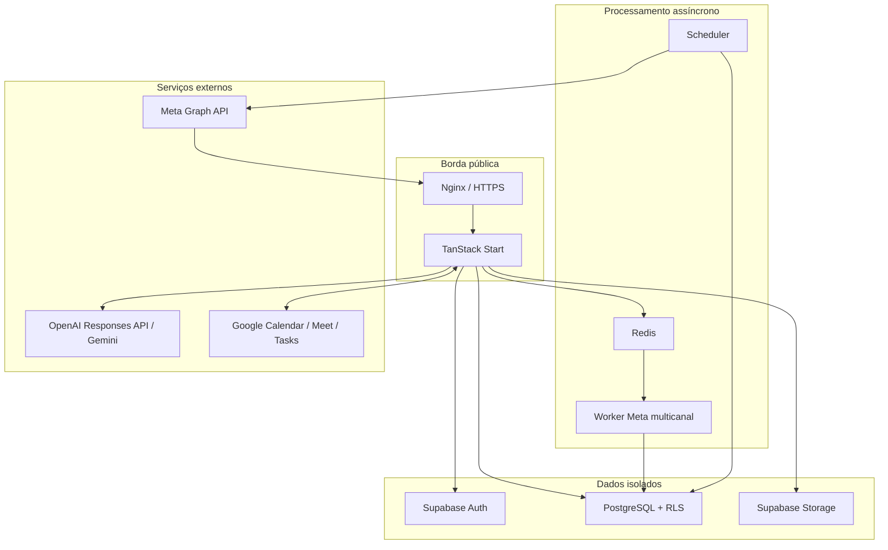
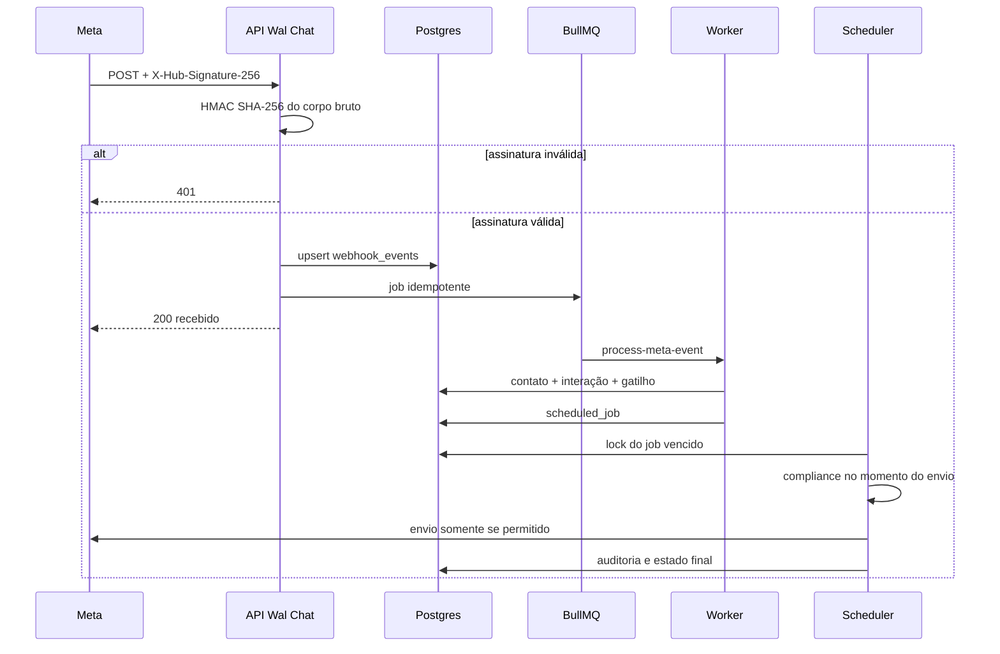

# Arquitetura do Wal Chat

## 1. Objetivo

O Wal Chat centraliza atendimento e automações de Instagram Professional e WhatsApp Business, além do conteúdo editorial. A arquitetura separa recepção de eventos, processamento assíncrono e envio para que uma indisponibilidade da Meta, do modelo de IA ou de um worker não bloqueie o webhook público.

## 2. Contextos do sistema

## 3. Componentes

### Aplicação TanStack Start

Entrega HTML SSR, assets estáticos, navegação React e endpoints HTTP. Em produção, `scripts/server.mjs` adapta requisições do Node para o contrato Fetch usado pelo bundle do TanStack Start e serve `dist/client` com proteção contra path traversal.

### Supabase

Fornece Auth, Postgres, REST, Realtime e Storage. O banco é a fonte de verdade para workspaces, contatos, interações, gatilhos, sequências e auditoria. O navegador usa somente a chave publishable; workers usam a service role no backend.

### Redis e BullMQ

O endpoint de webhook calcula SHA-256 do corpo bruto e usa o hash como `jobId`. Eventos repetidos são ignorados pelo índice único do banco e pelo identificador da fila. Uma redelivery da Meta após falha terminal abre no máximo uma nova rodada reivindicada no Postgres. Jobs falhos usam até cinco tentativas com backoff exponencial.

### Worker Meta multicanal

Consome a fila histórica `instagram-webhooks`, identifica o objeto do payload e chama `ingest_instagram_inbound` ou `ingest_whatsapp_inbound`. As RPCs criam ou reparam contato, interação, conversa e mensagem, com incremento atômico de não lidas. Delivery receipts do WhatsApp usam uma RPC monotônica. O worker não envia mensagens diretamente; cria `scheduled_jobs` deduplicados para concentrar o envio no scheduler.

### Scheduler

Executa a cada 60 segundos e reivindica até 50 jobs por ciclo numa transação com `FOR UPDATE SKIP LOCKED`. Locks abandonados são recuperados; claims de entrega antigos viram `unknown` antes de um job voltar à fila. Falhas transitórias usam backoff e a quinta tentativa é terminal. Tipos de job sem executor falham explicitamente.

### Motor de compliance

`evaluateCompliance` é uma função pura e testável. Ela é chamada no instante do envio e devolve `allowed`, política, corpo final, tempo restante e motivo de bloqueio. O sender não chama a Meta quando a decisão é negativa.

### Integrações externas

- Instagram API: login profissional, webhooks, DMs, Private Reply e publicação futura.
- WhatsApp Cloud API: Embedded Signup, WABA, telefone, templates, mensagens e statuses.
- OpenAI Responses API: provedor padrão para agentes, com `store: false`, safety identifier e configuração por workspace.
- Gemini 2.5 Flash: provedor opcional preservado para workspaces que o selecionarem.
- Google Workspace: OAuth com state/PKCE, Calendar, Meet, Tasks, sync
  incremental e Free/Busy. Tokens usam o mesmo cofre cifrado por tenant.
- SMTP: não configurado no MVP; necessário para confirmação e recuperação de contas.

## 4. Fluxo do webhook

O webhook responde rapidamente após persistência/enfileiramento. Nenhuma chamada de IA ou envio de DM é executado no request da Meta.

## 5. Fluxo de autenticação e tenancy

1. Supabase Auth valida e-mail/senha.
2. O trigger `handle_new_user` cria um workspace e associação `owner`.
3. O cliente envia o JWT Supabase.
4. A API cria um cliente Supabase com publishable key + JWT; leituras e configurações passam por RLS.
5. Policies consultam `workspace_members` via `is_workspace_member` e `has_workspace_role`.
6. Entidades com `workspace_id` ficam invisíveis a usuários de outros tenants.
7. A service role fica separada e só atua em mutações operacionais após RBAC explícito ou nos workers.
8. `integration_credentials` cifra tokens/API keys com AES-256-GCM v2 e AAD de tenant/escopo; somente a service role acessa a tabela.

## 6. Limites de confiança

| Origem           | Confiança                 | Controle                                                |
| ---------------- | ------------------------- | ------------------------------------------------------- |
| Navegador        | Não confiável             | JWT, RLS, Zod, chaves públicas somente                  |
| Webhook Meta     | Não confiável até validar | HMAC do corpo bruto e objeto Instagram/WhatsApp         |
| Redis            | Interno                   | Rede Docker isolada e payload mínimo                    |
| Worker/Scheduler | Backend privilegiado      | Service role e logs estruturados                        |
| OpenAI/Gemini    | Serviço externo           | Contexto limitado, sem secrets e opt-out pós-processado |
| Meta Graph API   | Serviço externo           | Tokens no backend, timeout/retry operacional            |
| Google Workspace | Serviço externo           | OAuth PKCE, token cifrado, Free/Busy e sync idempotente |

## 7. Disponibilidade e falhas

- `/api/health` é liveness do processo; `/api/ready` sonda Supabase e Redis e controla a entrada de tráfego.
- Os workers gravam heartbeats atômicos em `/tmp`; o Compose os considera unhealthy quando o heartbeat atrasa ou registra falha.
- Redis indisponível: em live, o webhook retorna `503` para a Meta tentar novamente; em demo o outbox Postgres continua disponível e o worker possui reconciliação automática.
- Supabase indisponível: o endpoint retorna `503` para a Meta tentar novamente.
- Meta indisponível: o scheduler registra erro e reagenda com backoff.
- IA indisponível: live falha sem enviar; somente demo pode usar resposta local determinística.
- Job duplicado: hash do evento e índices únicos evitam processamento duplicado.
- Processo encerrado: handlers `SIGTERM`/`SIGINT` fecham servidor, worker e conexões.

## 8. Ambientes

| Ambiente              | Dados                                    | Efeitos externos          | Uso                    |
| --------------------- | ---------------------------------------- | ------------------------- | ---------------------- |
| Interface demo        | Dados em memória                         | Bloqueados                | Demonstração rápida    |
| Desenvolvimento local | Supabase/Redis locais                    | Bloqueados por padrão     | Implementação e testes |
| Homologação           | Supabase CLI isolado                     | `DEMO_MODE=true`          | Testes públicos        |
| Produção real         | Supabase gerenciado ou self-host oficial | Permitidos após aprovação | Operação do cliente    |

## 9. Decisões registradas

- File-based routing reduz divergência entre telas e endpoints.
- Compliance fica fora dos componentes de UI para não depender do cliente.
- Scheduler consulta elegibilidade no envio, não apenas na criação da campanha.
- Private Reply usa tabela dedicada com unicidade por comentário.
- Secrets não recebem prefixo `VITE_`.
- A homologação usa portas, containers, rede, volume e projeto Supabase exclusivos.
- O acesso da aplicação containerizada ao Supabase usa a origem HTTPS pública, evitando dependência de loopback do host.
