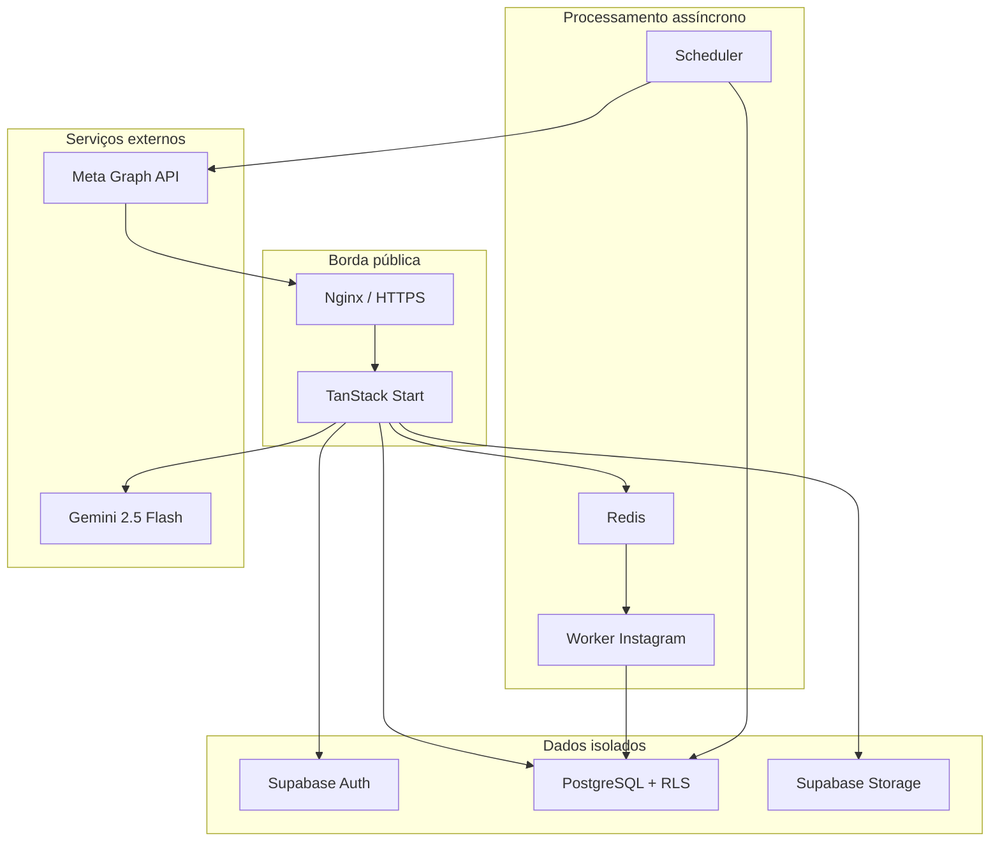
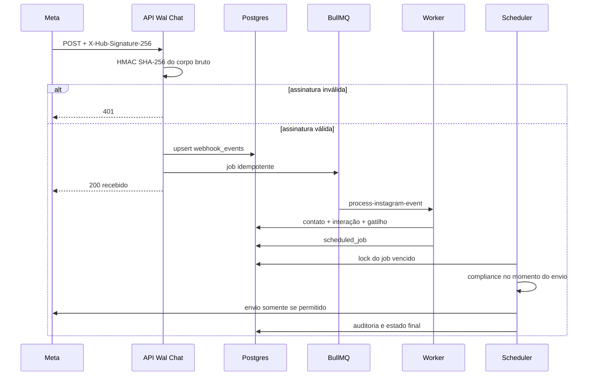

# Arquitetura do Wal Chat

## 1. Objetivo

O Wal Chat centraliza atendimento, automações e conteúdo de contas profissionais do Instagram. A arquitetura separa recepção de eventos, processamento assíncrono e envio para que uma indisponibilidade da Meta, do modelo de IA ou de um worker não bloqueie o webhook público.

## 2. Contextos do sistema

## 3. Componentes

### Aplicação TanStack Start

Entrega HTML SSR, assets estáticos, navegação React e endpoints HTTP. Em produção, `scripts/server.mjs` adapta requisições do Node para o contrato Fetch usado pelo bundle do TanStack Start e serve `dist/client` com proteção contra path traversal.

### Supabase

Fornece Auth, Postgres, REST, Realtime e Storage. O banco é a fonte de verdade para workspaces, contatos, interações, gatilhos, sequências e auditoria. O navegador usa somente a chave publishable; workers usam a service role no backend.

### Redis e BullMQ

O endpoint de webhook calcula SHA-256 do corpo bruto e usa o hash como `jobId`. Eventos repetidos são ignorados pelo índice único do banco e pelo identificador da fila. Jobs falhos usam até cinco tentativas com backoff exponencial.

### Worker Instagram

Consome `instagram-webhooks`, identifica a conta destinatária, cria/atualiza o contato, registra a interação e avalia gatilhos. O worker não envia mensagens diretamente; ele cria `scheduled_jobs` para concentrar o envio no scheduler.

### Scheduler

Executa a cada 60 segundos e processa até 50 jobs vencidos por ciclo. Um update condicional de `pending` para `processing` funciona como lock otimista. Falhas retornam o job para `pending` com backoff; após cinco tentativas, o estado vira `failed`.

### Motor de compliance

`evaluateCompliance` é uma função pura e testável. Ela é chamada no instante do envio e devolve `allowed`, política, corpo final, tempo restante e motivo de bloqueio. O sender não chama a Meta quando a decisão é negativa.

### Integrações externas

- Meta Graph API: webhook, DMs, Private Reply e publicação futura.
- Gemini 2.5 Flash: sugestões em PT-BR com histórico limitado às cinco últimas mensagens.
- SMTP: não configurado no MVP; necessário para confirmação e recuperação de contas.

## 4. Fluxo do webhook

O webhook responde rapidamente após persistência/enfileiramento. Nenhuma chamada lenta ao Gemini ou envio de DM é executado no request da Meta.

## 5. Fluxo de autenticação e tenancy

1. Supabase Auth valida e-mail/senha.
2. O trigger `handle_new_user` cria um workspace e associação `owner`.
3. O cliente envia o JWT Supabase.
4. Policies consultam `workspace_members` via `is_workspace_member` e `has_workspace_role`.
5. Entidades com `workspace_id` ficam invisíveis a usuários de outros tenants.
6. `private.instagram_credentials` é acessível somente à service role.

## 6. Limites de confiança

| Origem           | Confiança                 | Controle                                                |
| ---------------- | ------------------------- | ------------------------------------------------------- |
| Navegador        | Não confiável             | JWT, RLS, Zod, chaves públicas somente                  |
| Webhook Meta     | Não confiável até validar | HMAC do corpo bruto e tipo `instagram`                  |
| Redis            | Interno                   | Rede Docker isolada e payload mínimo                    |
| Worker/Scheduler | Backend privilegiado      | Service role e logs estruturados                        |
| Gemini           | Serviço externo           | Contexto limitado, sem secrets e opt-out pós-processado |
| Meta Graph API   | Serviço externo           | Tokens no backend, timeout/retry operacional            |

## 7. Disponibilidade e falhas

- Redis indisponível: o webhook pode persistir no outbox Supabase; a reconciliação do outbox ainda deve ser automatizada.
- Supabase indisponível: o endpoint retorna `503` para a Meta tentar novamente.
- Meta indisponível: o scheduler registra erro e reagenda com backoff.
- Gemini indisponível: a API retorna `502`; em demo usa resposta local segura.
- Job duplicado: hash do evento e índices únicos evitam processamento duplicado.
- Processo encerrado: handlers `SIGTERM`/`SIGINT` fecham servidor, worker e conexões.

## 8. Ambientes

| Ambiente              | Dados                       | Efeitos externos          | Uso                    |
| --------------------- | --------------------------- | ------------------------- | ---------------------- |
| Interface demo        | Dados em memória            | Bloqueados                | Demonstração rápida    |
| Desenvolvimento local | Supabase/Redis locais       | Bloqueados por padrão     | Implementação e testes |
| Homologação           | Stack isolada no servidor   | `DEMO_MODE=true`          | Testes públicos        |
| Produção real         | Projeto e secrets dedicados | Permitidos após aprovação | Operação do cliente    |

## 9. Decisões registradas

- File-based routing reduz divergência entre telas e endpoints.
- Compliance fica fora dos componentes de UI para não depender do cliente.
- Scheduler consulta elegibilidade no envio, não apenas na criação da campanha.
- Private Reply usa tabela dedicada com unicidade por comentário.
- Secrets não recebem prefixo `VITE_`.
- A homologação usa portas, containers, rede, volume e projeto Supabase exclusivos.
