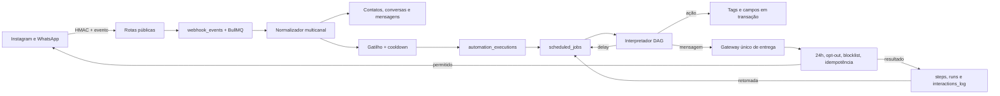
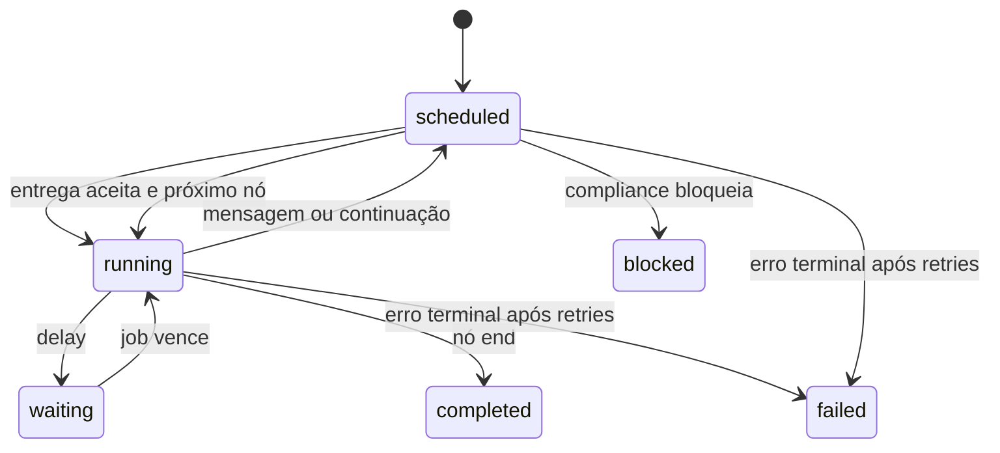

# Wal Chat — arquitetura do backend e motor de automações DAG

Data da revisão: 22/08/2026

## Resultado executivo

O backend anterior já possuía uma boa base para autenticação, multi-tenancy,
webhooks Meta assinados, ingestão idempotente, Inbox, compliance, gateway de
entrega, IA, Google Calendar e CRM. O principal limite estrutural era o motor de
automação: gatilhos podiam executar uma resposta única ou uma sequência linear,
mas não existia um workflow versionado, ramificado, auditável e retomável.

Esta evolução cria essa espinha dorsal. Uma automação agora é um DAG (grafo
direcionado acíclico) publicado em versão imutável. Cada contato possui uma
execução persistida, cada nó deixa trilha de auditoria e cada fronteira
assíncrona vira um `scheduled_job`. O motor nunca chama a Meta diretamente:
mensagens continuam obrigatoriamente no gateway do scheduler, que revalida
opt-out, janela de 24 horas, HUMAN_AGENT, templates, blocklist e idempotência no
instante do envio.

Esta implementação não transforma recursos demonstrativos antigos em produção
por declaração. Publicação de conteúdo, campanhas em massa, auto-like e
sincronização completa de Insights continuam sujeitos aos gates registrados no
README e no plano de produção.

## Conhecimento de referência aproveitado

O material fornecido sobre ferramentas de automação foi tratado como referência
arquitetural, não como instrução executável. Os padrões aproveitados foram:

- eventos ingressam por webhook e são deduplicados antes de produzir efeitos;
- automações precisam de versão publicada imutável;
- estado de execução deve sobreviver a restart do processo;
- atrasos precisam ser jobs persistentes, nunca timers em memória;
- ramificações A/B precisam ser determinísticas em retries;
- contatos possuem campos personalizados e o workspace possui variáveis globais;
- efeitos em CRM devem ser transacionais;
- todo envio externo deve convergir em um único gateway de compliance;
- logs precisam responder qual nó rodou, quando e com qual resultado.

## Arquitetura consolidada



## Modelo de dados novo

| Tabela                       | Responsabilidade                                                |
| ---------------------------- | --------------------------------------------------------------- |
| `custom_field_definitions`   | Define campos tipados armazenados em `contacts.custom_fields`.  |
| `automation_bot_fields`      | Variáveis globais tipadas do workspace.                         |
| `automation_flows`           | Rascunho editável, revisão otimista e ponteiro da versão atual. |
| `automation_flow_versions`   | Snapshot imutável do grafo publicado com SHA-256.               |
| `automation_executions`      | Máquina de estados por contato e versão.                        |
| `automation_execution_steps` | Auditoria por nó, estado, resultado e erro.                     |

Também foram adicionados:

- `triggers.flow_id`, com exatamente um destino entre resposta, sequência ou
  automação;
- `automation_runs.flow_execution_id`, ligando a telemetria antiga à execução
  DAG;
- o tipo `automation_step` em `scheduled_jobs`.

Todas as tabelas possuem `workspace_id`, RLS e GRANTs explícitos. Tabelas de
autoria são somente leitura para o navegador; mutações usam APIs server-side
com JWT, papel, origem confiável, limite de corpo e rate limit. Triggers de banco
impedem referências entre tenants mesmo quando as FKs simples seriam válidas.

## Contrato do grafo

O contrato está em `src/server/automation-graph.ts`, é validado com Zod e não
usa `eval` ou execução de código do usuário.

| Nó             | Comportamento                                                         |
| -------------- | --------------------------------------------------------------------- |
| `start`        | Entrada única obrigatória.                                            |
| `message`      | Renderiza texto seguro e agenda o gateway de entrega.                 |
| `action`       | Adiciona/remove tag e altera campos tipados em uma transação.         |
| `condition`    | Ramifica por contato, campo customizado, variável global ou contexto. |
| `delay`        | Persiste a retomada entre 1 segundo e 7 dias.                         |
| `random_split` | Distribuição A/B determinística; pesos precisam somar 100.            |
| `end`          | Finaliza a execução com outcome auditável.                            |

Invariantes verificadas antes da publicação:

- um único `start` e `entryNodeId` apontando para ele;
- IDs únicos e até 100 nós/200 arestas;
- todas as portas obrigatórias conectadas;
- nenhum ciclo ou nó inalcançável;
- referências de tag, agenda e campo pertencem ao workspace e estão ativas;
- valores de ações respeitam o tipo definido;
- tamanho máximo de 256 KiB para o grafo.

Templates aceitam somente:

```text
{{contact.display_name}}
{{custom.lead_score}}
{{bot.nome_da_empresa}}
{{context.source}}
```

Expressões, funções, acesso a `process.env` e JavaScript não são executados.

## Máquina de estados



Uma execução é idempotente por `(workspace_id, idempotency_key)`. O motor repara
automaticamente o caso de falha entre a criação da execução e a criação do job
inicial. Jobs e mensagens usam `dedupe_key`; uma divisão A/B usa o ID da execução
como seed, portanto um retry nunca troca o contato de variante.

O motor limita uma execução a 1.000 passos e processa no máximo 25 nós síncronos
por job. Esse yield impede monopolização do scheduler em grafos grandes.

## Integração Instagram e WhatsApp

Os dois processadores seguem o mesmo caminho:

1. evento inbound já deduplicado é persistido;
2. opt-out é aplicado antes de automações;
3. gatilhos ativos são avaliados em ordem;
4. cooldown de contato/gatilho é revalidado;
5. `automation_run` é criado de forma idempotente;
6. o destino pode ser resposta única, sequência legada ou fluxo DAG;
7. o scheduler interpreta o fluxo;
8. mensagem vai ao gateway existente;
9. o resultado de compliance/Meta é persistido;
10. somente então o próximo nó é agendado.

Para comentário do Instagram, a primeira mensagem usa Private Reply. Como a
Meta permite uma única resposta privada por comentário, a execução termina após
essa entrega e não tenta continuar automaticamente sem novo inbound.

O retry do WhatsApp foi alinhado ao do Instagram: uma interação que já possui
run não é confundida com cooldown e não cai indevidamente no agente autônomo.

## APIs do motor

| Método       | Endpoint                           | Papel mínimo      | Função                                   |
| ------------ | ---------------------------------- | ----------------- | ---------------------------------------- |
| `GET`        | `/api/automations`                 | membro            | Lista fluxos e métricas.                 |
| `POST`       | `/api/automations`                 | owner/admin       | Cria rascunho validado.                  |
| `GET`        | `/api/automations/:flowId`         | membro            | Exibe rascunho, versões e execuções.     |
| `PATCH`      | `/api/automations/:flowId`         | owner/admin       | Salva com `expectedRevision`.            |
| `POST`       | `/api/automations/:flowId`         | owner/admin       | Publica snapshot atômico.                |
| `DELETE`     | `/api/automations/:flowId`         | owner/admin       | Arquiva com revisão otimista.            |
| `POST`       | `/api/automations/:flowId/execute` | owner/admin/agent | Inicia para um contato, com request key. |
| `GET`        | `/api/automations/fields`          | membro            | Lista campos e variáveis.                |
| `POST/PATCH` | `/api/automations/fields`          | owner/admin       | Cria ou altera catálogo tipado.          |

Exemplo mínimo de grafo:

```json
{
  "schemaVersion": 1,
  "entryNodeId": "start",
  "nodes": [
    { "id": "start", "type": "start" },
    {
      "id": "welcome",
      "type": "message",
      "config": { "text": "Oi {{contact.display_name}}!" }
    },
    { "id": "end", "type": "end" }
  ],
  "edges": [
    { "from": "start", "to": "welcome", "branch": "default" },
    { "from": "welcome", "to": "end", "branch": "default" }
  ]
}
```

O rodapé não precisa ser confiado ao autor: o gateway mantém a regra central que
adiciona `Responda PARAR` a mensagens automáticas quando necessário.

## Segurança e confiabilidade

- autenticação e workspace são resolvidos no servidor;
- mutações exigem `Origin` confiável e papel adequado;
- corpo do grafo é limitado a 256 KiB;
- publicação usa lock, revisão otimista e transação PostgreSQL;
- versão executada é imutável, mesmo se o rascunho mudar;
- funções de efeito são revogadas de `anon` e `authenticated`;
- tabelas de execução são gravadas somente por `service_role`;
- referências cruzadas entre tenants são rejeitadas por trigger;
- variáveis são interpoladas sem executar expressões;
- efeitos de CRM são transacionais;
- jobs falhos recebem backoff exponencial e falham após cinco tentativas;
- o gateway usa claim persistente e não repete resposta externa ambígua;
- Private Reply possui claim at-most-once por comentário.

## Matriz atual do backend

| Domínio                     | Estado técnico          | Observação                                      |
| --------------------------- | ----------------------- | ----------------------------------------------- |
| Auth + multi-tenant         | Implementado            | JWT, RLS, papéis e isolamento por workspace.    |
| Webhooks Instagram/WhatsApp | Implementado            | HMAC, outbox, dedupe, worker e telemetria.      |
| Inbox e CRM                 | Implementado            | Contatos 360º, tags, auditoria e ações.         |
| Gateway/compliance          | Implementado            | Janela, opt-out, blocklist, templates e claims. |
| Automation Studio v2        | Implementado e validado | Canvas, versões, IA, n8n, handoff e subfluxo.   |
| IA copiloto/autônoma        | Implementado            | Produção depende de chave e política.           |
| Google Calendar/Meet/Tasks  | Implementado            | Produção depende de OAuth.                      |
| Campanhas em massa          | Parcial/bloqueado       | Dispatcher persistente dedicado ainda falta.    |
| Publicação de conteúdo      | Parcial                 | Efeitos externos ainda não liberados.           |
| Auto-like                   | Demonstrativo           | Não deve ser anunciado como ativo.              |
| Insights                    | Parcial                 | Ingestão oficial completa ainda falta.          |

## Lacunas deliberadamente não mascaradas

Para alcançar paridade mais ampla com plataformas maduras, permanecem como
fases posteriores:

- nó de captura de resposta com correlação e timeout;
- espera por evento/tag/campo, além de espera temporal;
- templates interativos por canal e captura de resposta correlacionada;
- HTTP Request com allowlist, proteção SSRF, cofre e circuit breaker;
- Dynamic Block com contrato JSON versionado;
- API pública com chaves por escopo, quotas e logs;
- Dynamic Block remoto com contrato JSON versionado;
- aprovação em quatro olhos para jornadas de alto volume.

O DAG v2 já cobre mensagem/mídia, IA, condição, ação, A/B, delay, handoff,
n8n e subfluxo. As lacunas restantes impedem declarar paridade total com
ManyChat e estão mantidas de forma explícita no roadmap.

## Procedimento de homologação

1. Fazer backup/snapshot do banco de homologação.
2. Aplicar `20260822010000_automation_dag_core.sql` em transação.
3. Executar o lint do banco e consultar migrations aplicadas.
4. Publicar aplicação, worker de webhook e scheduler da mesma revisão.
5. Confirmar `DEMO_MODE=true` durante os testes estruturais.
6. Criar campos e uma automação mínima pelas APIs.
7. Publicar a automação e associá-la a um gatilho.
8. Testar Instagram com tester do app e WhatsApp com número de teste.
9. Verificar `webhook_events`, `automation_runs`, `automation_executions`,
   `automation_execution_steps`, `scheduled_jobs` e `outbound_deliveries`.
10. Testar opt-out, cooldown, janela fechada, timeout da Meta e retry.
11. Somente depois habilitar a conta real de teste, com kill switches ativos.

## Evidências desta revisão

- TypeScript: `npx tsc --noEmit` aprovado.
- Testes: 24 arquivos e 78 testes aprovados.
- ESLint: aprovado sem findings.
- Build: cliente e SSR de produção aprovados.
- Parser PostgreSQL: migration aceita pelo `pglast`.
- Audit de dependências de produção: zero vulnerabilidades conhecidas.
- Auditoria estática: 48 APIs, zero findings.
- Rotas locais: 20 rotas, 404, health, robots e sitemap aprovados.
- Lint semântico SQL local: não executado porque Docker/Postgres local não está
  disponível no host; a CLI falhou ao conectar antes de analisar o schema.

Por esse último item, a migração deve ser validada em uma base descartável ou em
homologação com snapshot antes de qualquer aplicação em produção.
