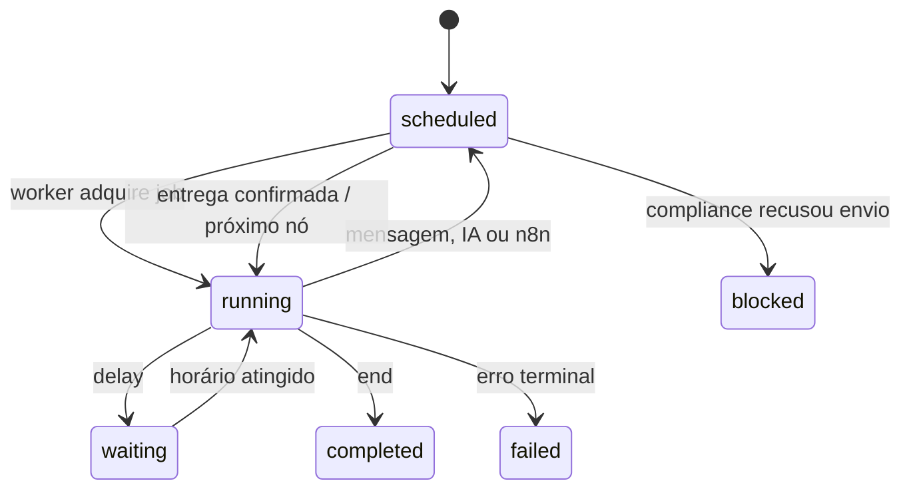

# Wal Chat — Automation Studio v2

Data da validação: **24/08/2026**

## Resultado

A antiga tela linear de Sequências foi substituída por um editor visual do
mesmo DAG versionado que o scheduler executa. Não existe mais um fluxo visual
de demonstração separado do backend: criar, salvar, publicar e executar usam
`automation_flows`, `automation_flow_versions`, `automation_executions` e
`automation_execution_steps`.

O Studio não contorna o gateway de mensageria. Mensagens de texto, mídia e
respostas geradas por IA viram jobs do scheduler e são reavaliadas quanto a
janela de 24h, opt-out, cooldown, blocklist, kill switch e idempotência antes de
qualquer chamada à Meta.

## Blocos disponíveis

| Bloco          | Efeito real                                                          | Fronteira de segurança                                              |
| -------------- | -------------------------------------------------------------------- | ------------------------------------------------------------------- |
| Entrada        | Ponto único vinculado a gatilho, chamada manual ou n8n               | Exatamente um nó inicial                                            |
| Mensagem       | Texto interpolado, imagem/vídeo HTTPS e link oficial de agenda       | Scheduler + gateway Meta + claim at-most-once                       |
| Agente de IA   | Usa agente ativo, conversa recente e base de conhecimento            | Agente deve ser autônomo e kill switch de IA deve estar on          |
| Espera         | Persiste próxima execução entre 1 segundo e 7 dias                   | Job durável; não mantém processo Node aberto                        |
| Condição       | Compara contato, campo personalizado, campo global ou contexto       | Operadores declarativos, sem `eval`                                 |
| Teste A/B      | Seleciona ramo por hash reproduzível e pesos totalizando 100%        | Retry nunca troca o contato de variante                             |
| Ação de CRM    | Adiciona/remove tag e define/limpa campos tipados                    | RPC transacional e validação do tenant                              |
| Handoff humano | Desliga IA, move Inbox, define prioridade/status e cria nota interna | Nota idempotente por execução+nó                                    |
| Evento n8n     | Envia campos declarados em webhook HMAC                              | Outbox, SSRF guard, timeout, retries e confirmação antes de retomar |
| Subfluxo       | Inicia outra versão publicada para o mesmo contato                   | Idempotência, proibição de autorreferência e profundidade 5         |
| Encerrar       | Registra resultado e conclui execução                                | Versão publicada permanece imutável                                 |

## Operação pela interface

1. Abra **Sequências** e crie uma jornada.
2. Selecione um bloco no canvas. Um novo bloco entra na conexão de saída
   selecionada sem deixar o grafo quebrado.
3. Configure o bloco no Inspetor. As rotas de condições e A/B podem apontar
   para qualquer nó válido do fluxo.
4. Use **Validar** para checar topologia, portas, ciclos, alcance e pesos.
5. Use **Salvar** para persistir o rascunho com revisão otimista.
6. Use **Publicar** para criar um snapshot imutável. Agentes, tags, campos,
   agendas, subfluxos e conexão n8n são novamente conferidos no servidor.
7. Escolha um contato controlado e use **Executar com segurança**. O botão só
   fica disponível para fluxos publicados e perfis autorizados.
8. Confira a trilha de execução e, para detalhes, os registros de
   `automation_execution_steps`.

## Variáveis e templates

Templates aceitam somente os namespaces abaixo:

```text
{{contact.display_name}}
{{contact.lead_score}}
{{custom.nome_do_campo}}
{{bot.nome_do_campo_global}}
{{context.source}}
```

O motor apenas substitui chaves alfanuméricas conhecidas. Não executa
JavaScript, expressões, chamadas de função ou acesso a `process.env`.

## Evento n8n de etapa

O tipo de outbox é `automation.node`. O payload entregue ao n8n contém:

```json
{
  "eventName": "lead.qualified",
  "flowId": "uuid",
  "executionId": "uuid",
  "contactId": "uuid",
  "nodeId": "n_...",
  "data": {
    "lead.score": "91"
  }
}
```

Somente os campos configurados no bloco são enviados. Chaves reservadas como
`__proto__`, `prototype` e `constructor` são rejeitadas. O fluxo só avança
depois que a outbox confirma a entrega; falta de assinatura para
`automation.node` é falha terminal explícita, não sucesso silencioso.

## Máquina de estados



## Migration

`20260824233000_automation_studio_v2.sql`:

- adiciona `automation.node` às assinaturas n8n existentes;
- cria vínculo opcional de notas da Inbox com execução+nó;
- impede nota duplicada em retry;
- valida que a execução da nota pertence ao mesmo workspace;
- corrige o constraint de `outbound_deliveries` para imagem e vídeo, que já
  eram suportados pelos senders mas eram recusados pelo claim do banco.

## Evidências de validação

| Verificação                                     | Resultado |
| ----------------------------------------------- | --------- |
| TypeScript `npx tsc --noEmit`                   | aprovado  |
| ESLint dos arquivos alterados                   | aprovado  |
| Build client + SSR                              | aprovado  |
| Vitest completo                                 | 99/99     |
| Testes de grafo, n8n e scheduled jobs           | 24/24     |
| Migration em clone de schema isolado PostgreSQL | aprovado  |
| Constraint de notas e mídia                     | aprovado  |
| Trigger de escopo da nota                       | aprovado  |
| QA visual desktop                               | aprovado  |
| QA responsivo 390×844                           | aprovado  |

O banco temporário `wal_chat_automation_studio_20260824_test` foi removido
após as asserções. A validação isolada não alterou dados de produção.

## Limites deliberados

- O grafo publicado é acíclico. Repetição usa subfluxo com limite de
  profundidade, evitando loops infinitos e cobrança acidental.
- IA em modo copiloto nunca é enviada automaticamente por um nó.
- O bloco n8n envia apenas dados explicitamente mapeados; não exporta o contato
  inteiro implicitamente.
- Private Reply de comentário continua sendo única e não encadeia uma sequência
  até que o contato responda e abra a janela padrão.
- “Paridade total com ManyChat” é uma meta de produto contínua, não uma
  alegação desta release. Esta versão entrega um núcleo operacional coerente,
  testado e extensível.

## Rollback operacional

1. Desligar `external_sends_enabled` e `autonomous_ai_enabled`.
2. Voltar os containers para a release anterior.
3. Manter a migration: ela é aditiva e compatível com o motor DAG v1.
4. Não apagar versões ou execuções para efetuar rollback de aplicação.
