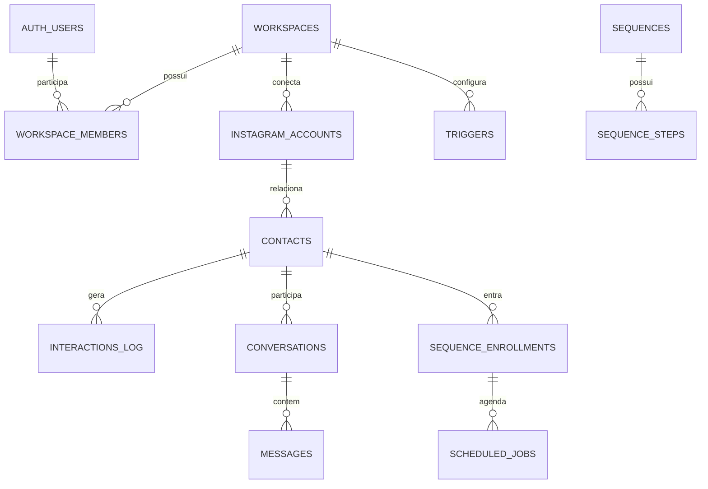

# Banco de dados e multi-tenancy

## 1. Princípio de isolamento

O `workspace_id` é a fronteira do tenant. Usuários autenticados só acessam linhas pertencentes a workspaces registrados em `workspace_members`. O backend privilegiado usa a service role exclusivamente em processos internos.



## 2. Tipos enumerados

| Tipo                    | Valores                                                             |
| ----------------------- | ------------------------------------------------------------------- |
| `workspace_role`        | `owner`, `admin`, `agent`, `viewer`                                 |
| `interaction_channel`   | `dm`, `comment`, `story_reply`, `mention`, `reaction`, `postback`   |
| `interaction_direction` | `inbound`, `outbound`                                               |
| `message_status`        | `queued`, `sent`, `delivered`, `read`, `failed`, `blocked`          |
| `trigger_source`        | `comment`, `dm`, `story`                                            |
| `match_mode`            | `exact`, `contains`                                                 |
| `sequence_step_kind`    | `text`, `media`, `typing`                                           |
| `ai_agent_mode`         | `copilot`, `autonomous`                                             |
| `content_kind`          | `feed`, `reel`, `story`, `carousel`                                 |
| `campaign_status`       | `draft`, `scheduled`, `running`, `paused`, `completed`, `cancelled` |
| `window_policy`         | `standard_24h`, `human_agent_7d`, `blocked`                         |

## 3. Catálogo de tabelas

### Tenancy e integrações

| Tabela                          | Responsabilidade                             |
| ------------------------------- | -------------------------------------------- |
| `workspaces`                    | Tenant, nome, slug e configurações           |
| `workspace_members`             | Associação usuário/workspace e papel         |
| `instagram_accounts`            | Contas profissionais conectadas e permissões |
| `private.instagram_credentials` | Tokens por conta; service role apenas        |

### CRM e Inbox

| Tabela             | Responsabilidade                                       |
| ------------------ | ------------------------------------------------------ |
| `contacts`         | Identidade Instagram, opt-out, IA e últimas interações |
| `tags`             | Taxonomia manual ou automática do workspace            |
| `contact_tags`     | Relação N:N entre contatos e tags                      |
| `conversations`    | Caixa, status da janela e atribuição                   |
| `messages`         | Mensagens visíveis na conversa                         |
| `interactions_log` | Auditoria normalizada de entrada, saída e bloqueios    |

### Conteúdo e Insights

| Tabela           | Responsabilidade                               |
| ---------------- | ---------------------------------------------- |
| `posts_cache`    | Cache de publicações e métricas Meta           |
| `content_items`  | Planejamento editorial e payload de publicação |
| `insights_daily` | Métricas agregadas por dia                     |

### Automação

| Tabela                    | Responsabilidade                                      |
| ------------------------- | ----------------------------------------------------- |
| `triggers`                | Palavra, origem, modo de match, resposta ou sequência |
| `trigger_cooldowns`       | Última execução por gatilho/contato                   |
| `comment_private_replies` | Trava de resposta privada única por comentário        |
| `sequences`               | Definição da automação multi-passo                    |
| `sequence_steps`          | Blocos ordenados e respectivos delays                 |
| `sequence_enrollments`    | Progresso do contato em uma sequência                 |
| `scheduled_jobs`          | Outbox/scheduler transacional                         |
| `webhook_events`          | Evento bruto, idempotência e estado de processamento  |

### IA, campanhas e proteção

| Tabela                | Responsabilidade                                |
| --------------------- | ----------------------------------------------- |
| `ai_agents`           | Persona, modo e habilitação do agente           |
| `knowledge_documents` | Base de conhecimento do agente                  |
| `campaigns`           | Segmento, mensagem, taxa e estado da campanha   |
| `campaign_recipients` | Snapshot de elegibilidade e entrega por contato |
| `blocklist_entries`   | Palavras e padrões proibidos por workspace      |

## 4. Views

### `dashboard_last_7_days`

Agrega contas alcançadas, DMs recebidas/enviadas, comentários e novos contatos dos sete dias mais recentes. Usa `security_invoker` para conservar o RLS do chamador.

### `contact_messaging_eligibility`

Calcula, por contato, a elegibilidade na janela padrão de 24 horas e na janela humana de sete dias. É uma pré-visualização; o envio ainda deve chamar `evaluateCompliance` com os dados atuais.

## 5. Funções e triggers

| Objeto                 | Função                                         |
| ---------------------- | ---------------------------------------------- |
| `set_updated_at`       | Atualiza `updated_at` antes de alterações      |
| `is_workspace_member`  | Confirma associação do usuário autenticado     |
| `has_workspace_role`   | Confirma papel permitido no workspace          |
| `handle_new_user`      | Cria workspace e membro `owner` após cadastro  |
| `on_auth_user_created` | Liga `auth.users` ao provisionamento do tenant |
| `set_*_updated_at`     | Triggers gerados para tabelas mutáveis         |

As funções de autorização usam `SECURITY DEFINER`, `search_path` fixo e parâmetros explícitos para evitar que a policy recursiva consulte diretamente a própria tabela protegida.

## 6. RLS e GRANTs

- RLS é habilitado em todas as tabelas públicas operacionais.
- `workspaces` permite leitura aos membros e alteração a `owner/admin`.
- `workspace_members` permite leitura aos membros e gestão a `owner/admin`.
- Demais tabelas recebem policies de `select`, `insert`, `update` e `delete` baseadas em `workspace_id`.
- `authenticated` recebe DML no schema público, sempre limitado pelo RLS.
- `service_role` recebe acesso total aos schemas público e privado.
- `authenticated` não recebe uso do schema `private`.

## 7. Índices e garantias de unicidade

- contatos: um `instagram_user_id` por workspace;
- interações: um `meta_event_id` por workspace quando presente;
- cooldown: um registro por gatilho/contato;
- Private Reply: um registro por ID de comentário;
- jobs: índice parcial por `run_at` quando `pending`;
- gatilhos: índice por workspace, origem e estado;
- posts: índice por workspace e data de publicação.

## 8. Migrations e seed

O schema versionado está em `supabase/migrations`. Nunca edite uma migration já aplicada em produção; crie outra com timestamp maior. `supabase/seed.sql` serve apenas para desenvolvimento/homologação e cria a conta local `demo@walchat.local`.

Fluxo seguro:

```bash
npx supabase migration new descricao_da_mudanca
npm run db:reset
npm run db:lint
npm test
```

## 9. Backup e restauração

O banco deve receber backup lógico diário e teste de restauração mensal. Volumes de Storage exigem cópia própria; o dump do Postgres não inclui os binários dos buckets.

Consulte o procedimento exato em [Manual interno de implementação e operação](MANUAL_INTERNO_IMPLEMENTACAO_E_OPERACAO.md#11-backup-e-recuperação).
