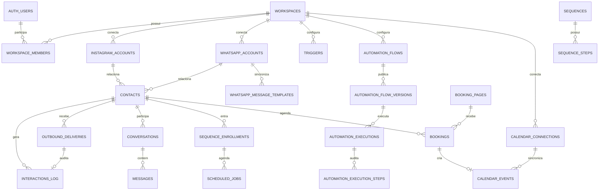

# Banco de dados e multi-tenancy

## 1. Princípio de isolamento

O `workspace_id` é a fronteira do tenant. Usuários autenticados só acessam linhas pertencentes a workspaces registrados em `workspace_members`. O backend privilegiado usa a service role exclusivamente em processos internos.



## 2. Tipos enumerados

| Tipo                    | Valores                                                                              |
| ----------------------- | ------------------------------------------------------------------------------------ |
| `workspace_role`        | `owner`, `admin`, `agent`, `viewer`                                                  |
| `interaction_channel`   | `dm`, `comment`, `story_reply`, `mention`, `reaction`, `postback`                    |
| `interaction_direction` | `inbound`, `outbound`                                                                |
| `message_status`        | `queued`, `sent`, `delivered`, `read`, `failed`, `blocked`                           |
| `trigger_source`        | `comment`, `dm`, `story`, `whatsapp`                                                 |
| `match_mode`            | `exact`, `contains`                                                                  |
| `sequence_step_kind`    | `text`, `media`, `typing`                                                            |
| `ai_agent_mode`         | `copilot`, `autonomous`                                                              |
| `content_kind`          | `feed`, `reel`, `story`, `carousel`                                                  |
| `campaign_status`       | `draft`, `scheduled`, `running`, `paused`, `completed`, `cancelled`                  |
| `window_policy`         | `standard_24h`, `human_agent_7d`, `private_reply_7d`, `whatsapp_template`, `blocked` |

## 3. Catálogo de tabelas

### Tenancy e integrações

| Tabela                       | Responsabilidade                                                 |
| ---------------------------- | ---------------------------------------------------------------- |
| `workspaces`                 | Tenant, nome, slug e configurações                               |
| `workspace_members`          | Associação usuário/workspace e papel                             |
| `instagram_accounts`         | Perfil, scopes, webhook, validade e estado da conexão            |
| `whatsapp_accounts`          | WABA, telefone, scopes, webhook e estado da conexão              |
| `whatsapp_message_templates` | Cache completo de templates e status oficial da WABA             |
| `integration_credentials`    | Tokens/API keys cifrados; sem acesso `anon/authenticated`        |
| `integration_oauth_states`   | States Meta curtos, de uso único e protegidos contra replay      |
| `integration_audit_logs`     | Auditoria sanitizada de conectar, validar, renovar e desconectar |
| `calendar_connections`       | Conta Google, escopos, seleções e sync token; sem credenciais    |

### CRM e Inbox

| Tabela                   | Responsabilidade                                                                   |
| ------------------------ | ---------------------------------------------------------------------------------- |
| `contacts`               | Identidade Meta e perfil CRM: estágio, score, responsável, consentimento e arquivo |
| `tags`                   | Taxonomia manual/automática, descrição e arquivamento reversível                   |
| `contact_tags`           | Relação N:N com origem manual, gatilho, sequência, importação ou sistema           |
| `contact_notes`          | Notas internas por contato, com autoria e pin                                      |
| `contact_audit_log`      | Trilha imutável das ações manuais do CRM                                           |
| `conversations`          | Caixa, status da janela e atribuição                                               |
| `messages`               | Mensagens visíveis na conversa                                                     |
| `interactions_log`       | Auditoria normalizada de entrada, saída e bloqueios                                |
| `outbound_deliveries`    | Claim persistente e resultado de cada DM externa                                   |
| `conversation_notes`     | Notas internas da equipe, sem envio ao Instagram                                   |
| `crm_pipelines`          | Funis comerciais isolados por workspace                                            |
| `crm_stages`             | Etapas ordenadas e estados terminais do pipeline                                   |
| `crm_leads`              | Oportunidades, valores, responsáveis, próxima ação e revisão otimista              |
| `crm_lead_activities`    | Histórico comercial da oportunidade                                                |
| `crm_lead_scores`        | Probabilidade e faixa calculada da oportunidade                                    |
| `crm_lead_risk_states`   | Estado materializado de risco por inatividade                                      |
| `message_templates`      | Respostas rápidas pessoais e compartilhadas                                        |
| `attendant_availability` | Disponibilidade e capacidade por membro                                            |
| `webhook_sources`        | Fonte de captação com token irreversível                                           |
| `webhook_lead_captures`  | Recebimentos externos e estado de processamento                                    |
| `ai_budgets`             | Limite mensal e política de bloqueio de IA                                         |
| `ai_agent_versions`      | Snapshots imutáveis das configurações de agentes                                   |
| `ai_routers`             | Estratégias de roteamento entre agentes                                            |
| `org_memory_entries`     | Memórias organizacionais curtas e auditáveis                                       |
| `agent_cases`            | Casos escalados para revisão humana                                                |
| `ai_execution_log`       | Tokens, latência e resultado sem armazenar conteúdo                                |
| `api_audit_log`          | Trilha unificada de mutações administrativas                                       |

### Conteúdo e Insights

| Tabela           | Responsabilidade                               |
| ---------------- | ---------------------------------------------- |
| `posts_cache`    | Cache de publicações e métricas Meta           |
| `content_items`  | Planejamento editorial e payload de publicação |
| `insights_daily` | Métricas agregadas por dia                     |

### Calendário e agendamentos

| Tabela                | Responsabilidade                                                 |
| --------------------- | ---------------------------------------------------------------- |
| `calendar_events`     | Eventos locais/Google, Meet, convidados e vínculos do produto    |
| `calendar_tasks`      | Tarefas locais ou Google Tasks, prazo, prioridade e responsável  |
| `booking_pages`       | Slug, duração, fuso, disponibilidade, buffers e antecedência     |
| `bookings`            | Reserva do lead, contato, intervalo, estado, Meet e idempotência |
| `calendar_activities` | Trilha temporal das principais ações do Wal Chat                 |

### Automação

| Tabela                       | Responsabilidade                                      |
| ---------------------------- | ----------------------------------------------------- |
| `triggers`                   | Palavra, origem, modo de match, resposta ou sequência |
| `trigger_cooldowns`          | Última execução por gatilho/contato                   |
| `comment_private_replies`    | Trava de resposta privada única por comentário        |
| `sequences`                  | Definição da automação multi-passo                    |
| `sequence_steps`             | Blocos ordenados e respectivos delays                 |
| `sequence_enrollments`       | Progresso do contato em uma sequência                 |
| `scheduled_jobs`             | Outbox/scheduler transacional                         |
| `webhook_events`             | Evento bruto, idempotência e estado de processamento  |
| `automation_runs`            | Execução auditável de cada match de automação         |
| `custom_field_definitions`   | Catálogo tipado de campos por contato                 |
| `automation_bot_fields`      | Variáveis globais tipadas do workspace                |
| `automation_flows`           | Rascunho e revisão otimista do DAG                    |
| `automation_flow_versions`   | Snapshots publicados, imutáveis e com checksum        |
| `automation_executions`      | Estado persistente do fluxo por contato               |
| `automation_execution_steps` | Auditoria de cada nó interpretado                     |

### IA, campanhas e proteção

| Tabela                       | Responsabilidade                                    |
| ---------------------------- | --------------------------------------------------- |
| `ai_provider_settings`       | Provedor, modelo, esforço e limites do workspace    |
| `ai_agents`                  | Persona, modo, provedor e limites do agente         |
| `knowledge_documents`        | Base de conhecimento global ou ligada ao agente     |
| `campaigns`                  | Segmento, mensagem, taxa e estado da campanha       |
| `campaign_recipients`        | Snapshot de elegibilidade e entrega por contato     |
| `blocklist_entries`          | Palavras e padrões proibidos por workspace          |
| `workspace_runtime_settings` | Kill switches de envio, Comment-to-DM e IA autônoma |

### Privacidade e confiança pública

| Tabela                      | Responsabilidade                                                      |
| --------------------------- | --------------------------------------------------------------------- |
| `data_deletion_requests`    | Comprovante sem PII para signed requests processados pela Meta        |
| `privacy_deletion_requests` | Pedido LGPD do formulário, identidade a verificar e protocolo opaco   |
| `customer_reviews`          | Avaliação publicada somente com verificação e consentimento explícito |

## 4. Views

### `dashboard_last_7_days`

Agrega contas alcançadas, DMs recebidas/enviadas, comentários e novos contatos dos sete dias mais recentes. Usa `security_invoker` para conservar o RLS do chamador.

### `contact_messaging_eligibility`

Calcula, por contato, a elegibilidade na janela padrão de 24 horas, `HUMAN_AGENT` do Instagram e template obrigatório do WhatsApp. É uma pré-visualização; o envio ainda chama o motor de compliance com os dados atuais.

### `list_workspace_contacts_crm(...)`

Função `security invoker` paginada usada pela tela de Contatos. Pesquisa nome,
identidade, email e telefone; combina filtros de canal, elegibilidade, estágio,
tag, responsável e arquivo; agrega tags e devolve o total filtrado sem furar o
RLS do workspace.

## 5. Funções e triggers

| Objeto                            | Função                                                 |
| --------------------------------- | ------------------------------------------------------ |
| `set_updated_at`                  | Atualiza `updated_at` antes de alterações              |
| `is_workspace_member`             | Confirma associação do usuário autenticado             |
| `has_workspace_role`              | Confirma papel permitido no workspace                  |
| `handle_new_user`                 | Cria workspace e membro `owner` após cadastro          |
| `on_auth_user_created`            | Liga `auth.users` ao provisionamento do tenant         |
| `set_*_updated_at`                | Triggers gerados para tabelas mutáveis                 |
| `search_knowledge_documents`      | Busca full-text PT-BR da base, restrita à service role |
| `ingest_whatsapp_inbound`         | Ingestão WhatsApp transacional e idempotente           |
| `apply_whatsapp_delivery_status`  | Delivery receipt monotônico e atômico                  |
| `process_meta_data_deletion`      | Exclusão transacional de dados Instagram/WhatsApp      |
| `reserve_calendar_booking`        | Lock e reserva sem sobreposição, somente service role  |
| `record_wal_calendar_activity`    | Projeta ações relevantes na linha do tempo             |
| `publish_automation_flow`         | Publica snapshot do DAG sob lock e revisão             |
| `apply_automation_actions`        | Tags e campos tipados em uma transação                 |
| `validate_automation_field_value` | Valida tipos também dentro do PostgreSQL               |

As funções de autorização usam `SECURITY DEFINER`, `search_path` fixo e parâmetros explícitos para evitar que a policy recursiva consulte diretamente a própria tabela protegida.

## 6. RLS e GRANTs

- RLS é habilitado em todas as tabelas públicas operacionais.
- `workspaces` permite leitura aos membros e alteração a `owner/admin`.
- `workspace_members` permite leitura aos membros e gestão a `owner/admin`.
- Demais tabelas recebem policies baseadas em `workspace_id`.
- `instagram_accounts`, `ai_agents`, `knowledge_documents` e `ai_provider_settings` só podem ser alteradas por `owner/admin`; membros mantêm leitura.
- `integration_credentials` e `integration_oauth_states` não têm GRANT para `anon/authenticated` e são operadas somente pela service role.
- `calendar_activities` é append-only para usuários; conexões Google só podem
  ser alteradas por `owner/admin`; eventos, tarefas e bookings por
  `owner/admin/agent`.
- `outbound_deliveries` também é service-role only: contém corpo da mensagem, destinatário, decisão de compliance e estado de entrega.
- `privacy_deletion_requests` e `customer_reviews` não têm policy nem GRANT para
  `anon/authenticated`; a API pública devolve somente protocolo/status ou
  avaliações já verificadas, consentidas e publicadas.
- `authenticated` recebe DML no schema público, sempre limitado pelo RLS.
- As tabelas de autoria e execução do DAG são uma exceção deliberada: o
  navegador recebe somente `SELECT`; mutações passam pelas APIs e pela
  `service_role` depois de autenticação, papel e origem serem validados.
- `service_role` recebe acesso total aos schemas público e privado.
- `authenticated` não recebe uso do schema `private`.

## 7. Índices e garantias de unicidade

- contatos Meta: um `instagram_user_id` ou
  `(whatsapp_account_id, whatsapp_user_id)` por workspace;
- contatos manuais: email ou telefone único dentro do workspace; nunca possuem
  conta Meta nem elegibilidade de envio;
- interações: um `meta_event_id` por workspace quando presente;
- mensagens: uma linha por `interaction_id` e um ID de provedor por workspace/canal;
- entregas externas: uma chave idempotente por workspace e um único vínculo no `interactions_log`;
- credenciais: uma por workspace, provedor, tipo e `scope_key`;
- cooldown: um registro por gatilho/contato;
- Private Reply: um registro por ID de comentário;
- jobs: índice parcial por `run_at` quando `pending`;
- gatilhos: índice por workspace, origem e estado;
- posts: índice por workspace e data de publicação.
- reservas: chave idempotente por workspace e um slot ativo por página/início;
  a RPC também bloqueia qualquer intervalo sobreposto;
- eventos/tarefas: unicidade por conexão e ID Google, com índices por intervalo;
- atividades: índice por workspace/data e por origem.
- automações: nome único por workspace, versão única por fluxo, execução única
  por chave idempotente e etapa única por execução/nó/tentativa.

## 8. Migrations e seed

O schema versionado está em `supabase/migrations`. Nunca edite uma migration já aplicada em produção; crie outra com timestamp maior. `supabase/seed.sql` serve apenas para desenvolvimento/homologação e cria a conta local `demo@walchat.local`.

A migration `20260730223000_outbound_delivery_idempotency.sql` adiciona o claim de entrega externa antes da chamada à Meta. Seus estados são:

- `claimed`: chamada ainda em andamento; retry automático é bloqueado;
- `sent`: Meta confirmou e o ID do provedor foi persistido;
- `blocked`: compliance recusou, sem efeito externo;
- `unknown`: houve timeout ou falha depois do claim e o resultado externo é ambíguo; exige reconciliação humana.

A migration `20260820120000_operational_go_live.sql` adiciona controles de runtime por workspace, notas de Inbox, execuções de automação, telemetria de webhook e recuperação textual da base de conhecimento. Ela é aditiva e inicia todos os switches de efeito externo desligados.

A migration `20260821010000_public_privacy_reviews.sql` adiciona pedidos LGPD
persistidos e o catálogo de avaliações reais. As duas tabelas são
`service_role`-only; publicar uma avaliação sem consentimento e verificação
viola uma constraint do banco.

A migration `20260822010000_automation_dag_core.sql` adiciona o DAG versionado,
variáveis tipadas, execução auditável, publicação atômica, RLS/GRANTs restritos
e validações de escopo entre tenants. Consulte
[Backend e automações DAG](ARQUITETURA_BACKEND_AUTOMACOES_DAG_2026-08-22.md).

Fluxo seguro:

```bash
npx supabase migration new descricao_da_mudanca
npm run db:reset
npm run db:lint
npm test
```

## 9. Backup e restauração

O banco deve receber backup lógico diário e teste de restauração mensal. Volumes de Storage exigem cópia própria; o dump do Postgres não inclui os binários dos buckets.

Consulte o procedimento exato em [Manual interno de implementação e operação](MANUAL_INTERNO_IMPLEMENTACAO_E_OPERACAO.md#11-backup-e-recuperação).
