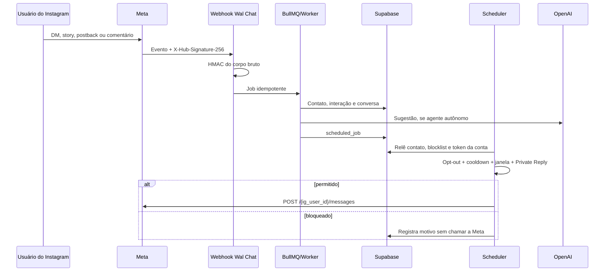

# Configuração real da Meta e OpenAI

Este é o runbook autoritativo para sair do modo demonstração e iniciar testes controlados com uma conta Instagram profissional real. Ele descreve a configuração externa, o que o backend faz e os testes que devem ser concluídos antes do Live Mode.

## 1. Estado de prontidão

| Capacidade         | Implementação no Wal Chat                                        | Dependência externa                                     |
| ------------------ | ---------------------------------------------------------------- | ------------------------------------------------------- |
| Login multi-tenant | Supabase Auth + workspace + RLS                                  | SMTP antes de produção                                  |
| Conectar Instagram | OAuth Business Login for Instagram com `state` de uso único      | App ID/secret e redirect HTTPS                          |
| Token por tenant   | AES-256-GCM em `integration_credentials`; service role only      | Usuário concede os scopes                               |
| Webhook            | Challenge GET, HMAC `X-Hub-Signature-256`, idempotência e BullMQ | Callback e campos configurados no painel Meta           |
| DMs                | `graph.instagram.com/{version}/{ig_user_id}/messages`            | Permissão de mensagens e conversa iniciada pelo contato |
| Private Reply      | Uma resposta por comentário, até sete dias                       | Permissão de comentários                                |
| HUMAN_AGENT        | Somente envio manual, até sete dias                              | Feature Human Agent aprovada                            |
| IA                 | OpenAI Responses API ou Gemini por workspace                     | Chave válida do provedor                                |
| Agentes            | CRUD, persona, base textual, copiloto, autônomo e playground     | Provedor habilitado                                     |

O código está pronto para homologação integrada. A aprovação real das chamadas Meta/OpenAI só pode ser comprovada com as credenciais do projeto e uma conta adicionada como tester/admin. Não marque o sistema como Live até completar a matriz da seção 10.

## 2. Decisão de integração Meta

O Wal Chat usa **Instagram API with Instagram Login**. Nesse modelo:

- o host da API é `graph.instagram.com`;
- o login é Business Login for Instagram;
- a conta deve ser Professional, tipo Business ou Creator;
- não é obrigatório vincular uma Página do Facebook;
- anúncios e tagging não estão disponíveis nesse tipo de integração.

Referência oficial: [Instagram API with Instagram Login](https://www.postman.com/meta/instagram/folder/23987686-98bfade9-3736-4738-8b4a-f56d6534f6de).

Não misture esse fluxo com Instagram API with Facebook Login. Os hosts, tokens e nomes de permissões são diferentes.

## 3. O que criar antes de conectar

### 3.1 Contas

1. Uma conta Meta do responsável técnico.
2. Um Business Portfolio da empresa; conclua a verificação empresarial quando o painel solicitar.
3. Uma conta Instagram Professional Business ou Creator para homologação.
4. Um app Meta do tipo Business, dedicado ao Wal Chat.
5. Um projeto OpenAI dedicado, com orçamento e chave próprios.

Durante o Development Mode, a pessoa que autoriza e a conta profissional precisam atender às regras de teste/roles do app. Para contas de terceiros, solicite Advanced Access e conclua o App Review. A coleção oficial da Meta diferencia Standard Access para ativos próprios e Advanced Access para contas que o app não possui/administra.

### 3.2 URLs públicas

Na homologação atual:

```text
Origem:             https://wal-chat.64.181.178.125.nip.io
OAuth Redirect URI: https://wal-chat.64.181.178.125.nip.io/api/integrations/meta/callback
Webhook Callback:   https://wal-chat.64.181.178.125.nip.io/api/public/webhooks/instagram
Política:           https://wal-chat.64.181.178.125.nip.io/privacidade
Termos:             https://wal-chat.64.181.178.125.nip.io/termos
Exclusão:           https://wal-chat.64.181.178.125.nip.io/exclusao-de-dados
```

O Redirect URI deve ser idêntico em protocolo, host, caminho e barra final ao valor cadastrado na Meta. Para produção, substitua `nip.io` por domínio próprio antes do App Review.

## 4. Configuração no painel Meta

Os nomes de menus podem mudar, mas os objetos são os mesmos.

1. Crie o app Business e adicione o produto Instagram/API com Instagram Login.
2. Em configurações básicas, informe domínio, política de privacidade, termos, exclusão de dados e e-mail de contato.
3. Em Business Login for Instagram, cadastre o OAuth Redirect URI da seção 3.2.
4. Em Webhooks, selecione o objeto Instagram e configure:
   - Callback URL: `/api/public/webhooks/instagram`;
   - Verify token: exatamente o valor de `META_VERIFY_TOKEN`;
   - certificado HTTPS válido.
5. Assine os campos usados pelo backend:
   - `messages`;
   - `messaging_postbacks`;
   - `messaging_seen`;
   - `message_reactions`;
   - `comments`;
   - `live_comments`;
   - `mentions`;
   - `story_insights`.
6. Adicione o usuário e a conta de teste aos roles/ativos permitidos no Development Mode.
7. Gere eventos de teste no painel e confirme HTTP 200.

O Wal Chat ainda executa `POST /{ig_user_id}/subscribed_apps` depois do OAuth. Essa assinatura por conta não substitui o cadastro do callback no app. A lista e o endpoint estão na [referência oficial de assinatura de webhooks](https://www.postman.com/meta/instagram/request/23987686-0223707a-7035-46a2-8015-1fdf7249278f).

## 5. Permissões e revisão

O OAuth solicita:

```text
instagram_business_basic
instagram_business_manage_messages
instagram_business_manage_comments
instagram_business_content_publish
instagram_business_manage_insights
```

As quatro primeiras aparecem no conjunto principal da documentação oficial; Insights usa `instagram_business_manage_insights`. Os scopes antigos `business_*` foram descontinuados em 27 de janeiro de 2025 e não devem ser usados.

Solicite Advanced Access para todas as capacidades usadas com contas que não pertencem aos administradores do app. Prepare para o App Review:

- screencast contínuo do login até a funcionalidade;
- credencial de reviewer e conta Professional de teste;
- explicação objetiva de cada permissão;
- política, termos e exclusão funcionando em HTTPS;
- instruções reproduzíveis em PT-BR e, se solicitado, inglês;
- evidência de opt-out, janela de 24h e ausência de automação com HUMAN_AGENT.

`HUMAN_AGENT` é uma feature/permissão separada no App Review. A Meta permite atendimento humano até sete dias e proíbe mensagens automáticas com essa tag. Referência: [HUMAN_AGENT oficial](https://www.postman.com/meta/instagram/request/23987686-3f06ebc8-c5ad-4b8a-be9f-81acdc79245c).

Private Reply permite uma única mensagem em até sete dias; uma segunda mensagem só é possível se a pessoa responder e abrir uma janela padrão. Para Live, a resposta privada só pode ocorrer enquanto a transmissão está ativa. Referência: [Private Replies oficial](https://www.postman.com/meta/instagram/request/23987686-189d7215-22b3-403f-b2f5-a46c7e66a514).

## 6. Secrets do backend

Configure no `.env.production`, nunca no Git e nunca com prefixo `VITE_`:

```dotenv
META_APP_ID=...
META_APP_SECRET=...
META_VERIFY_TOKEN=valor-aleatorio-longo
META_GRAPH_VERSION=v25.0
META_OAUTH_REDIRECT_URI=https://wal-chat.64.181.178.125.nip.io/api/integrations/meta/callback

# Gerar com: openssl rand -base64 32
CREDENTIALS_ENCRYPTION_KEY=...

OPENAI_API_KEY=...
OPENAI_MODEL=gpt-5.6-sol
OPENAI_PROJECT=...
OPENAI_ORGANIZATION=...

APP_ORIGIN=https://wal-chat.64.181.178.125.nip.io
DEMO_MODE=false
```

`META_ACCESS_TOKEN` e `META_PUBLISH_TOKEN` permanecem aceitos apenas para compatibilidade/demonstração. Em `DEMO_MODE=false`, o sender exige o token OAuth cifrado da conta e nunca cai para o token global.

Após alterar secrets:

```bash
docker compose --env-file .env.production \
  -f docker-compose.production.yml up -d --build --force-recreate
docker compose --env-file .env.production \
  -f docker-compose.production.yml ps
```

## 7. Conectar uma conta pelo Wal Chat

1. Entre com um usuário real do Supabase com papel `owner` ou `admin`.
2. Abra **Configurações**.
3. Confirme que “Plataforma Meta configurada” está disponível.
4. Clique em **Conectar Instagram**.
5. Autorize todos os scopes na Meta.
6. O callback valida o `state` no cookie e no Postgres, troca o code por token long-lived, lê o perfil, assina webhooks e cifra o token.
7. De volta à tela, confira usuário, tipo de conta, permissões, token e vencimento.
8. Clique em **Validar**. O backend relê perfil e assinaturas; campos ausentes aparecem na tela e em `integration_audit_logs`.

Tabelas para diagnóstico:

- `instagram_accounts`: perfil, scopes, campos, validade e erro sanitizado;
- `integration_credentials`: segredo cifrado; somente service role;
- `integration_oauth_states`: state curto e de uso único;
- `integration_audit_logs`: conectar, validar, renovar e desconectar.

O scheduler tenta renovar tokens long-lived antes do vencimento. Falhas ficam isoladas por conta e não autorizam uso do token de outro tenant.

## 8. Configurar OpenAI e agentes

O backend usa a **Responses API**, recomendada para novos projetos, com `store: false`, `safety_identifier` derivado por hash e limites por agente. Consulte [migração para Responses API](https://developers.openai.com/api/docs/guides/migrate-to-responses) e [práticas de segurança](https://developers.openai.com/api/docs/guides/safety-best-practices).

### 8.1 Chave gerenciada ou por workspace

- Chave em `OPENAI_API_KEY`: compartilhada pelo ambiente, útil para operação gerenciada.
- Chave salva na tela Configurações: cifrada e isolada no workspace; tem prioridade sobre a chave do servidor.

No painel OpenAI, crie um projeto do Wal Chat, defina limites de gasto, alertas e uma chave de service account/projeto com menor privilégio possível. Nunca cole a chave em persona ou base de conhecimento.

### 8.2 Configuração

1. Em **Configurações > Provedor de IA**, selecione OpenAI.
2. Escolha o modelo, esforço de raciocínio, verbosidade e limite de tokens.
3. Cole a API key apenas se o workspace usar chave própria.
4. Salve e confirme “Configurado”.
5. Em **Agentes de IA**, crie a persona, tom, modo e limite de caracteres.
6. Adicione somente documentos aprovados à base de conhecimento.
7. Teste no Playground. O playground nunca envia mensagem ao Instagram.

No modo copiloto, a resposta é somente sugestão. No modo autônomo, um inbound elegível pode gerar um job; o scheduler reaplica opt-out, blocklist e janela antes de enviar. Falha de IA pode mover a conversa para `ia_off` quando o fallback está habilitado.

## 9. Como o backend protege o fluxo



Comentários, menções e reações não atualizam `last_inbound_at`; portanto, não abrem indevidamente a janela padrão de DM. Private Reply usa sua política própria. Retries repetidos são barrados antes de incrementar a inbox ou agendar nova automação.

## 10. Matriz de testes com redes reais

Execute em ordem e registre data, conta e evidência.

### Fase A — estática e banco

```bash
npm ci
npx tsc --noEmit
npm run lint
npm test
npm run build
npm run db:lint
```

Com Docker/Supabase local ativo, execute também `npm run db:reset`. A recriação local é destrutiva apenas para dados de desenvolvimento.

### Fase B — infraestrutura

- `GET /api/health` retorna `ok: true` e `status: "alive"`.
- `GET /api/ready` retorna `200`, com Supabase e Redis em `up`.
- app, Redis, worker e scheduler estão `healthy`; os dois workers publicam heartbeat próprio.
- callback, política, termos e exclusão respondem por HTTPS.
- assinatura inválida no webhook retorna 401.
- verify token errado retorna 403.
- o container da aplicação alcança o Supabase pela origem HTTPS configurada, sem depender de porta publicada apenas em `127.0.0.1`.

### Fase C — OAuth

- conexão conclui sem erro;
- token aparece como cifrado/salvo, nunca em resposta HTTP;
- scopes e campos estão completos;
- botão **Validar** retorna sucesso;
- desconectar remove a credencial e a conta passa a `disconnected`.

### Fase D — mensageria e compliance

- DM do contato cria contato, conversa e mensagem inbound;
- resposta automática em até 24h inclui `Responda PARAR`;
- segundo disparo do mesmo gatilho em 24h é bloqueado pelo cooldown;
- `PARAR` grava opt-out e bloqueia envios seguintes;
- comentário dispara no máximo uma Private Reply;
- retry do mesmo webhook não duplica inbox nem job;
- retry manual com o mesmo `Idempotency-Key` devolve o resultado anterior sem segunda DM;
- timeout após o claim deixa a entrega `unknown` e não executa retry automático;
- comentário/reação não abre janela de DM;
- fora de 24h, automação é bloqueada;
- HUMAN_AGENT só funciona no endpoint/tela manual e até sete dias;
- termo ativo na blocklist bloqueia o envio no último instante.

### Fase E — IA

- playground responde pelo modelo configurado e acrescenta opt-out;
- persona e conhecimento vêm do banco, não do payload do navegador;
- chave de outro workspace nunca é consultada;
- agente copiloto não envia sozinho;
- agente autônomo cria job e ainda respeita todas as regras da Fase D;
- erro do provedor não envia fallback inventado em live mode.

### Critério de liberação

Somente habilite teste ampliado quando A–E estiverem verdes. Live Mode exige adicionalmente App Review/Advanced Access, Human Agent se usado, rate limiting, observabilidade, SMTP, backup/restauração e rotina definitiva de exclusão de dados. Para o primeiro piloto, siga os checkpoints e o escopo reduzido de [Validação de produção real V1](VALIDACAO_PRODUCAO_REAL_V1.md).

## 11. Operação e rotação

- Rotacione `META_APP_SECRET` e `CREDENTIALS_ENCRYPTION_KEY` somente com plano de migração; trocar a chave de cifra sem recifrar invalida credenciais já salvas.
- Para rotacionar o token de uma conta, reconecte-a pelo OAuth.
- Para rotacionar a OpenAI key do workspace, salve a nova chave na tela Configurações.
- Ao desligar um cliente, use **Desconectar**, revogue acessos na Meta e remova a chave de IA do workspace.
- Nunca registre token, API key, payload integral sensível ou conteúdo de base de conhecimento em logs públicos.

## 12. Pendências que não podem ser simuladas

- consentimento OAuth com o App ID/secret reais;
- escopos efetivamente aprovados para a conta de teste;
- entrega e recebimento na rede Meta;
- App Review e mudança para Live Mode;
- cobrança, limites e disponibilidade da conta OpenAI real;
- publicação e Insights reais das telas que ainda usam dados demonstrativos.

Esses itens dependem das contas externas. A ausência das credenciais não é substituída por mocks e deve continuar aparecendo como pendência no relatório de homologação.

## 13. Ordem de ativação na Central de Go-Live

Depois de concluir as fases A–E, abra **Operações** e resolva todos os bloqueios críticos. A liberação ocorre em camadas:

1. deixe `DEMO_MODE=true` durante a configuração e o smoke;
2. conecte e valide a conta Meta pelo assistente;
3. configure o provedor de IA e teste o playground;
4. mude o ambiente para `DEMO_MODE=false` e reinicie os três processos;
5. digite `ATIVAR PRODUCAO` e habilite disparos externos;
6. habilite Comment-to-DM apenas para a regra piloto;
7. habilite IA autônoma somente após aprovar o copiloto e as fontes;
8. acompanhe webhooks falhos e entregas `unknown` durante todo o piloto.

O kill switch principal do workspace é a primeira ação em um incidente. Nunca contorne o gateway chamando a Graph API diretamente de uma rota ou worker novo. O contrato técnico completo está em [Atualização operacional V1](ATUALIZACAO_OPERACIONAL_V1.md).
