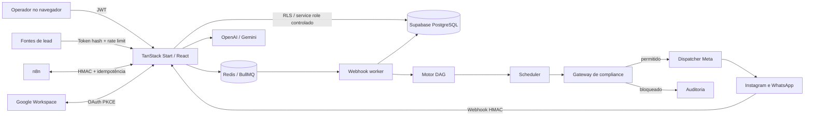

# Documentação completa do Wal Chat

Este documento consolida o estado funcional e técnico do Wal Chat. Ele é a
porta de entrada para produto, desenvolvimento, segurança e operação; os links
ao longo do texto levam aos runbooks e contratos detalhados.

Última verificação: **02/09/2026 — America/Sao_Paulo**.

## 1. Resumo executivo

O Wal Chat é uma plataforma SaaS multi-tenant para atendimento, CRM,
automação, conteúdo e relacionamento em Instagram Professional e WhatsApp
Business. O núcleo combina React/TanStack Start, Supabase/PostgreSQL, Redis,
BullMQ e integrações server-to-server com Meta, OpenAI, Google e n8n.

Estado observado em produção em 02/09/2026:

| Item                                   | Estado verificado                                                                                |
| -------------------------------------- | ------------------------------------------------------------------------------------------------ |
| URL                                    | `https://wal-chat.64.181.178.125.nip.io`                                                         |
| Release ativa                          | `/opt/wal-chat/releases/20260831-ux-v1`                                                          |
| Runtime                                | `live`                                                                                           |
| App, Redis, webhook worker e scheduler | 4/4 saudáveis, zero reinícios                                                                    |
| Supabase                               | disponível                                                                                       |
| Migration CRM/IA                       | `20260828090000_deskcomm_capabilities_core` aplicada                                             |
| OpenAI                                 | configuração de servidor e chave de workspace presentes; modelo `gpt-5.6-sol`                    |
| Gemini                                 | não configurado                                                                                  |
| Google Workspace                       | cliente OAuth configurado no servidor; nenhum token OAuth de workspace registrado                |
| Instagram                              | `walfredonetto` conectado e com nove campos assinados; `wal.chat` conectado sem campos assinados |
| WhatsApp                               | infraestrutura/Embedded Signup configurados; nenhuma conta WABA/telefone registrada no workspace |
| n8n                                    | credenciais cifradas presentes no workspace operacional                                          |
| Gates do workspace `Wal Demo`          | envios externos, Comment-to-DM e IA autônoma habilitados                                         |
| Workspace administrativo               | sem canais, IA ou gates operacionais                                                             |

“Configurado” no readiness significa que o servidor possui a configuração-base.
Isso não substitui uma conexão OAuth ou uma conta de canal registrada para o
tenant. A distinção é importante para Google e WhatsApp.

## 2. Perfis de uso e isolamento

- Cada cliente opera dentro de um `workspace`.
- Usuários pertencem ao workspace por `workspace_members` e possuem papel
  `owner`, `admin`, `attendant` ou equivalente definido no banco.
- O JWT identifica o usuário; a API resolve o workspace e a função antes de
  executar uma operação.
- RLS restringe leitura por membership. Escritas sensíveis passam pelo backend
  com `service_role` depois de validação de sessão, papel, schema Zod e regras de
  negócio.
- Credenciais são vinculadas ao workspace, cifradas no backend e nunca
  devolvidas ao navegador.

## 3. Mapa funcional

### 3.1 Atendimento e relacionamento

- **Dashboard:** DMs, comentários, canais, contatos e insights consolidados.
- **Inbox unificada:** Instagram e WhatsApp, filtros Principal/Geral/Pedidos/IA
  off, prioridade, responsável, notas, perfil do contato, agendamento e sugestão
  por IA.
- **Contatos e tags:** perfil 360º, score, estágio, responsável, campos
  personalizados, notas fixáveis, filtros, lote e exportação CSV.
- **Respostas rápidas:** templates pessoais ou compartilhados, com inserção
  direta no compositor da Inbox.
- **Equipe:** disponibilidade, capacidade, horário de atendimento e distribuição
  manual, round-robin ou menor carga.

### 3.2 CRM comercial

- Pipelines e etapas ordenadas por workspace.
- Kanban com drag-and-drop e atualização por `lock_version` para evitar perda de
  escrita concorrente.
- Oportunidade vinculada a contato, responsável, origem, valor, probabilidade,
  próxima ação, motivo de perda e trilha de atividades.
- Score e risco persistidos separadamente.
- Radar identifica inatividade, atraso e risco; o scheduler reconcilia os
  estados a cada cinco minutos.
- Cada workspace recebe pipeline e etapas padrão por bootstrap transacional.

Detalhes: [Integração Deskcomm](INTEGRACAO_DESKCOMM_2026-08-28.md).

### 3.3 Gatilhos, sequências e chatbots

- Gatilhos por comentário, DM, resposta de Story e WhatsApp.
- Comment-to-DM limitado a uma resposta privada por comentário e cooldown por
  contato/gatilho.
- Automation Studio baseado em DAG versionado e publicações imutáveis.
- Nós suportados: entrada, mensagem/mídia, botões, pergunta validada, espera,
  condição, A/B determinístico, CRM, IA, handoff humano, HTTP externo, evento
  n8n confirmado, subfluxo e encerramento.
- Simulador executa a jornada sem publicar nem enviar.
- Execuções usam idempotência, limites de profundidade, scheduler persistente e
  trilha de estado.

Detalhes: [Automation Studio v2](AUTOMATION_STUDIO_V2_2026-08-24.md) e
[Lógica de Sequências](LOGICA_DE_NEGOCIO_SEQUENCIAS.md).

### 3.4 IA e governança

- Provedores: OpenAI Responses API e Gemini.
- Configuração por workspace: provedor, modelo, esforço de raciocínio,
  verbosidade, limite de saída e chave opcional do tenant.
- O botão **Salvar configurações** valida a chave diretamente no provedor,
  persiste apenas a versão cifrada e registra auditoria sem revelar o segredo.
- Se o campo de chave ficar vazio, a API preserva a chave já salva ou usa a
  chave do servidor, quando disponível.
- Agentes têm persona, tom, modo copiloto/autônomo, base de conhecimento,
  tamanho máximo e fallback humano.
- Governança inclui orçamento mensal, snapshots de agente, roteadores, memória
  organizacional, casos de revisão humana e log de execução sem prompt/resposta.
- Antes de uma chamada, o backend resolve configuração e orçamento; após a
  chamada registra provedor, modelo, tokens, latência, custo estimado e estado.

### 3.5 Conteúdo, agenda e crescimento

- Calendário em mês, semana e agenda; eventos, tarefas, campanhas, conteúdo e
  reservas compartilham a mesma visão.
- Página pública de agendamento e reserva transacional de horário.
- Google Calendar, Tasks, Meet e Free/Busy por OAuth PKCE.
- Feed, Reel, Story e Carrossel com persistência, agendamento e publicação pelo
  scheduler.
- Reengajamento com preview de elegibilidade, início, pausa, cancelamento e
  vazão configurável de 30–45/min.
- Growth links e QR codes.
- Insights oficiais com métricas diárias e por publicação.
- Auto-like mantém preferências, mas não executa curtidas: a API oficial da Meta
  não oferece essa operação.

### 3.6 Integrações e captação

- OAuth e webhooks Instagram.
- WhatsApp Cloud API, Embedded Signup, templates, mídia e receipts.
- n8n bidirecional: eventos de saída assinados e comandos inbound autenticados,
  limitados e idempotentes.
- Fontes de webhook de lead com token armazenado somente como hash, payload de
  até 64 KB, rate limit, sanitização, deduplicação e criação de contato/lead.
- Google Workspace com PKCE e tokens cifrados.

### 3.7 Operação, privacidade e site público

- Central de Go-Live com readiness, diagnóstico de integrações, webhooks e kill
  switches.
- Auditoria por workspace para mudanças administrativas e operações sensíveis.
- Política de Privacidade, Termos e fluxo de Exclusão de Dados.
- GA4 condicionado ao consentimento.
- Landing page, 404, página de obrigado, canonical, Open Graph, JSON-LD,
  sitemap e robots.
- Manual operacional pesquisável dentro da aplicação.

## 4. Arquitetura



### Componentes em produção

| Serviço                | Responsabilidade                                              |
| ---------------------- | ------------------------------------------------------------- |
| `wal-chat-app-1`       | SSR, interface e APIs HTTP                                    |
| `wal-chat-redis-1`     | filas, locks e limites distribuídos                           |
| `wal-chat-webhooks-1`  | consumo dos eventos Meta                                      |
| `wal-chat-scheduler-1` | delays, campanhas, publicações, agenda, outbox e radar CRM    |
| Supabase isolado       | Auth, Postgres, Storage, REST, Realtime e serviços auxiliares |
| Nginx                  | TLS, proxy reverso, limites e cabeçalhos                      |

O Compose usa a imagem compartilhada `wal-chat-app:latest`; cada publicação é
extraída em `/opt/wal-chat/releases/<release>` e o diretório da release passa a
ser o `working_dir` do projeto Compose.

## 5. Fluxos críticos

### Webhook Meta

1. O endpoint lê o corpo bruto.
2. Valida `X-Hub-Signature-256` com segredo do canal.
3. Aplica limite de tamanho e rate limit.
4. Persiste uma chave idempotente.
5. Enfileira o evento.
6. O worker normaliza contato, conversa, mensagem, comentário ou receipt.
7. Gatilhos elegíveis iniciam o DAG.

### Envio de mensagem

1. A API valida sessão, workspace e payload.
2. O gateway de compliance revalida janela, opt-out, cooldown, tag e gate.
3. Um claim persistente impede duplicidade.
4. O dispatcher chama a API Meta.
5. Sucesso ou falha definitiva é persistido.
6. Timeout/resposta ambígua vira `unknown`; não há retry automático que possa
   duplicar a mensagem.

### Salvamento da API de IA

1. Somente owner/admin pode alterar.
2. O payload é validado por provedor/modelo.
3. A chave informada — ou a chave cifrada já existente — é testada no endpoint
   oficial do provedor.
4. Preferências são gravadas em `ai_provider_settings`.
5. A chave é cifrada e armazenada em `integration_credentials`.
6. O log de auditoria registra metadados, nunca a chave.

### Lead webhook

1. A URL contém um token aleatório; o banco mantém apenas seu hash.
2. A origem é resolvida sem revelar o token.
3. Limite, tamanho, JSON e mapeamento são validados.
4. O payload é sanitizado e deduplicado.
5. Contato e oportunidade são criados/atualizados de forma idempotente.

## 6. Superfície HTTP

Todas as rotas `/api/*`, exceto as explicitamente públicas e health checks,
exigem JWT e membership de workspace. Alterações administrativas exigem papel
elevado.

### Sistema e operação

| Endpoint                   | Métodos    | Uso                                        |
| -------------------------- | ---------- | ------------------------------------------ |
| `/api/health`              | GET        | liveness do processo                       |
| `/api/ready`               | GET        | Supabase, Redis, modo e capacidades        |
| `/api/workspaces`          | GET        | workspaces da sessão                       |
| `/api/operations/go-live`  | GET, PATCH | diagnóstico e gates                        |
| `/api/operations/webhooks` | GET, POST  | observabilidade/reprocessamento controlado |
| `/api/audit`               | GET        | trilha administrativa                      |

### Atendimento, contatos e CRM

| Endpoint                         | Métodos                  | Uso                                      |
| -------------------------------- | ------------------------ | ---------------------------------------- |
| `/api/dashboard`                 | GET                      | métricas do painel                       |
| `/api/inbox`                     | GET, POST, PATCH, DELETE | conversas, estado e notas                |
| `/api/inbox/agendar`             | GET, POST                | agendamento a partir da conversa         |
| `/api/messages/send`             | POST                     | envio pelo gateway de compliance         |
| `/api/contacts`                  | GET, POST                | lista e criação                          |
| `/api/contacts/:contactId`       | GET, PATCH               | perfil e atualização                     |
| `/api/contacts/:contactId/notes` | POST, PATCH, DELETE      | notas                                    |
| `/api/contacts/bulk`             | PATCH                    | operação em lote                         |
| `/api/contact-tags`              | GET, POST, PATCH, DELETE | tags e vínculos                          |
| `/api/crm`                       | GET, POST                | pipeline e oportunidades                 |
| `/api/crm/:leadId`               | PATCH                    | movimentação com concorrência otimista   |
| `/api/crm/radar`                 | GET                      | risco e inatividade                      |
| `/api/team`                      | GET, PATCH               | disponibilidade, capacidade e roteamento |
| `/api/templates`                 | GET, POST                | respostas rápidas                        |
| `/api/templates/:templateId`     | POST, PATCH, DELETE      | uso e manutenção de resposta             |

### Automação e IA

| Endpoint                            | Métodos                       | Uso                                         |
| ----------------------------------- | ----------------------------- | ------------------------------------------- |
| `/api/triggers`                     | GET, POST, PATCH, DELETE      | gatilhos                                    |
| `/api/sequences`                    | GET, POST, PATCH, PUT, DELETE | sequências legadas/compatibilidade          |
| `/api/automations`                  | GET, POST                     | fluxos DAG                                  |
| `/api/automations/:flowId`          | GET, POST, PATCH, DELETE      | edição, publicação e clone                  |
| `/api/automations/:flowId/execute`  | POST                          | execução controlada                         |
| `/api/automations/:flowId/simulate` | POST                          | simulação sem envio                         |
| `/api/automations/fields`           | GET, POST, PATCH              | campos do editor                            |
| `/api/ai/settings`                  | GET, PUT                      | provedor, modelo e chave cifrada            |
| `/api/ai/agents`                    | GET, POST, PATCH, DELETE      | agentes                                     |
| `/api/ai/knowledge`                 | GET, POST, PATCH, DELETE      | base de conhecimento                        |
| `/api/ai/suggest`                   | POST                          | sugestão de resposta                        |
| `/api/governance`                   | GET, POST, PATCH              | orçamento, router, memória, casos e versões |
| `/api/compliance/check`             | POST                          | prévia de elegibilidade                     |

### Conteúdo, agenda e crescimento

| Endpoint                      | Métodos                       | Uso                             |
| ----------------------------- | ----------------------------- | ------------------------------- |
| `/api/calendar`               | GET, POST, PATCH, DELETE      | eventos/tarefas unificados      |
| `/api/calendar/booking-pages` | GET, POST, PATCH, DELETE      | páginas públicas                |
| `/api/calendar/bookings`      | PATCH                         | remarcação/cancelamento         |
| `/api/content`                | GET, POST, PATCH, PUT, DELETE | conteúdo e publicação           |
| `/api/campaigns`              | GET, POST                     | reengajamento                   |
| `/api/insights`               | GET, POST                     | leitura e sincronização         |
| `/api/auto-like`              | GET, PUT                      | preferências, sem execução Meta |
| `/api/growth-links`           | GET, POST, DELETE             | links rastreáveis               |
| `/api/growth-links/qrcode`    | GET                           | QR code                         |
| `/api/icebreakers`            | GET, PUT                      | atalhos iniciais de conversa    |

### Integrações

| Endpoint                              | Métodos           | Uso                                         |
| ------------------------------------- | ----------------- | ------------------------------------------- |
| `/api/integrations/meta/start`        | POST              | início OAuth Instagram                      |
| `/api/integrations/meta/callback`     | GET               | callback OAuth                              |
| `/api/integrations/meta/status`       | GET               | status sanitizado                           |
| `/api/integrations/meta/validate`     | POST              | validação token/permissões                  |
| `/api/integrations/meta/disconnect`   | DELETE            | desconexão                                  |
| `/api/integrations/meta/media`        | GET, POST         | mídia Instagram                             |
| `/api/integrations/meta/whatsapp/*`   | GET, POST, DELETE | signup, conta, mídia, templates e validação |
| `/api/integrations/google/start`      | POST              | início OAuth PKCE                           |
| `/api/integrations/google/callback`   | GET               | callback                                    |
| `/api/integrations/google/status`     | GET, PATCH        | conexão e preferências                      |
| `/api/integrations/google/sync`       | POST              | sincronização                               |
| `/api/integrations/google/disconnect` | POST              | revogação/desconexão                        |
| `/api/integrations/n8n/status`        | GET               | status da ponte                             |
| `/api/integrations/n8n/configure`     | PUT               | conexão cifrada                             |
| `/api/integrations/n8n/test`          | POST              | teste técnico                               |
| `/api/integrations/n8n/events`        | POST              | evento outbound                             |
| `/api/integrations/n8n/disconnect`    | DELETE            | desconexão                                  |
| `/api/webhook-sources`                | GET, POST         | fontes externas de lead                     |

### Endpoints públicos

| Endpoint                                 | Métodos   | Proteção                                              |
| ---------------------------------------- | --------- | ----------------------------------------------------- |
| `/api/public/webhooks/instagram`         | GET, POST | verify token + HMAC                                   |
| `/api/public/webhooks/whatsapp`          | GET, POST | verify token + HMAC                                   |
| `/api/public/webhooks/n8n/:connectionId` | POST      | credential/HMAC, timestamp, rate limit e idempotência |
| `/api/public/webhooks/leads/:token`      | POST      | token hash, 64 KB, rate limit e dedupe                |
| `/api/public/bookings/:slug`             | GET, POST | slug, disponibilidade e reserva transacional          |
| `/api/public/reviews`                    | GET       | leitura sanitizada                                    |
| `/api/data-deletion`                     | GET, POST | callback assinado da Meta                             |

Contratos completos: [API e webhooks](API_E_WEBHOOKS.md).

## 7. Dados

As migrations são append-only e ficam em `supabase/migrations`. Os principais
domínios são:

- identidade: `workspaces`, `workspace_members`;
- canais: `instagram_accounts`, `whatsapp_accounts`, credenciais privadas;
- atendimento: `contacts`, `conversations`, mensagens, notas e tags;
- compliance: `interactions_log`, `outbound_deliveries`, opt-out e cooldown;
- automação: flows, versões, execuções, jobs, gatilhos e campanhas;
- agenda/conteúdo: eventos, tarefas, bookings, páginas e publicações;
- CRM: pipelines, etapas, leads, atividades, score e risco;
- equipe/templates: disponibilidade e respostas rápidas;
- integrações: credenciais, outbox n8n, fontes/capturas de webhook;
- IA: configurações, versões, budgets, routers, memória, casos e logs;
- auditoria/privacidade: eventos administrativos e pedidos de exclusão.

O inventário de tabelas, políticas, funções e índices está em
[Banco de dados](BANCO_DE_DADOS.md).

## 8. Segurança e compliance

- TLS no Nginx e HSTS.
- CSP com nonce, `frame-ancestors 'none'`, `X-Content-Type-Options`,
  `Referrer-Policy` e `Permissions-Policy`.
- JWT, RLS e checagem de papel no backend.
- Credenciais cifradas em repouso; UI mostra apenas presença/status.
- HMAC em webhooks Meta e n8n.
- Rate limit distribuído para endpoints públicos e ações sensíveis.
- Limite de payload e schema validation.
- Idempotência em ingestão, filas e envio.
- Janela Meta de 24 horas e `HUMAN_AGENT` restrito ao atendimento humano por até
  sete dias.
- `PARAR`, blocklist, cooldown, única Private Reply e revalidação no momento do
  envio.
- Logs de IA sem prompt/resposta e logs administrativos sem segredos.
- Exclusão de dados persistida e rastreável.

Não publique `.env`, dumps, tokens, chaves ou cookies. Há registro histórico de
credenciais já expostas em commits antigos; rotação continua obrigatória mesmo
que o texto seja removido do branch atual.

Detalhes: [Segurança e compliance](SEGURANCA_E_COMPLIANCE.md).

## 9. Configuração de ambiente

O arquivo `.env.example` é o catálogo sem segredos. Os grupos principais são:

- Supabase público e service role;
- Redis/BullMQ;
- criptografia de credenciais;
- Meta Instagram e WhatsApp;
- OpenAI/Gemini;
- Google OAuth;
- origem pública, suporte, endereço e Analytics;
- gates globais de segurança.

Em produção, `.env.production` é copiado da release anterior, tem permissão
restrita e nunca entra no pacote nem no Git.

## 10. Desenvolvimento e validação

Requisitos: Node 22+, npm 10+, Docker Compose e Supabase CLI.

```bash
npm ci
npm run local:up
cp .env.example .env.local
npm run db:reset
npm run dev:all
```

Portas padrão: app `3001`, Supabase local conforme `supabase/config.toml` e Redis
exposto pelo Compose de desenvolvimento.

Antes de publicar:

```bash
npx tsc --noEmit
npm run lint
npm run check
npm test
npm run build
npm run audit:system
SMOKE_APP_URL=http://127.0.0.1:3001 npm run validate:routes
```

Migrations devem passar em banco isolado ou em `BEGIN/ROLLBACK` no ambiente de
destino antes da aplicação. A ausência de Docker local não autoriza pular esse
teste.

## 11. Deploy e rollback

Fluxo de produção:

1. confirmar saúde, disco e release ativa;
2. criar e verificar backup completo;
3. preservar a imagem atual com tag de rollback;
4. montar pacote sem secrets/caches/builds;
5. conferir SHA-256 no servidor;
6. extrair em nova pasta de release e copiar `.env.production` com modo `600`;
7. testar migration com rollback;
8. aplicar migration em transação única e registrar versão;
9. construir `wal-chat-app:latest` dentro da nova release;
10. promover com Docker Compose;
11. validar readiness, rotas, auth guards, banco, containers e logs;
12. manter release e imagem anteriores até a janela de observação encerrar.

Rollback da aplicação usa o Compose da release anterior e a imagem preservada.
Rollback de banco deve seguir a política da migration; mudanças destrutivas
exigem restauração do backup, nunca `git reset` ou SQL improvisado.

Runbook: [Deploy e segurança](DEPLOY_2026-08-25_MANYCHAT_E_SEGURANCA.md).

## 12. Backup e restauração

O backup completo de produção inclui:

- dump lógico e custom-format do PostgreSQL;
- snapshot Redis;
- volumes Storage e Edge Runtime;
- releases, migrations, configurações e secrets protegidos;
- Nginx e TLS;
- inventário Docker e imagens Wal Chat;
- manifesto e SHA-256 por artefato.

Scripts:

```bash
sudo bash scripts/ops/create-complete-backup.sh YYYYMMDDTHHMMSS-pre-live
sudo bash scripts/ops/verify-complete-backup.sh /var/backups/wal-chat/ARQUIVO.tar.gz
```

O backup local do repositório deve combinar:

1. archive do worktree, incluindo arquivos ainda não commitados e excluindo
   secrets/caches/builds/backups anteriores;
2. `git bundle --all`, para preservar branches, tags e histórico;
3. manifesto com branch, commit, `git status`, tamanhos e hashes SHA-256.

Restauração só é considerada pronta depois de verificar hash, integridade do
archive, `git bundle verify` e leitura do manifesto.

## 13. Observabilidade e resposta a incidentes

- `/api/health`: processo vivo.
- `/api/ready`: dependências e capacidades essenciais.
- Docker healthchecks em app, Redis, worker e scheduler.
- Logs estruturados com `request-id` e sem secrets.
- Operações de webhook permitem inspeção e reprocessamento controlado.
- Entregas outbound mantêm estado persistente e diferenciam falha de resultado
  ambíguo.
- Auditoria registra mudanças administrativas e integrações.

Em incidente: desative o gate correspondente, preserve logs/IDs, confirme
idempotência, evite reenvio manual e só então aplique correção ou rollback.

## 14. Limitações e pendências reais

- `_fat.tech` ainda não consta como conta Instagram conectada; o tenant possui
  `walfredonetto` e `wal.chat`.
- Não há WABA/telefone WhatsApp registrado, apesar de o Embedded Signup estar
  configurado no servidor.
- Google possui configuração-base, mas não há credential OAuth de workspace.
- Gemini não está configurado.
- Auto-like não é executável pela API oficial.
- Cobrança/planos ainda não limitam recursos.
- Backups de produção ainda dependem de execução operacional; automatização e
  testes periódicos de restauração continuam recomendados.
- O domínio `nip.io` serve o ambiente atual, mas um domínio próprio é indicado
  para operação comercial e verificação Google.
- Credenciais antigas presentes no histórico público devem ser rotacionadas.

## 15. Fonte de verdade por assunto

- Operação pela interface: [Manual completo](MANUAL_COMPLETO_ACESSOS_OPERACAO_CONFIGURACAO.md)
- Estrutura do software: [Arquitetura](ARQUITETURA.md) e [Mapa do código](MAPA_DO_CODIGO.md)
- Banco: [Banco de dados](BANCO_DE_DADOS.md)
- APIs: [API e webhooks](API_E_WEBHOOKS.md)
- Compliance: [Segurança e compliance](SEGURANCA_E_COMPLIANCE.md)
- Deploy: [Runbook de deploy](DEPLOY_2026-08-25_MANYCHAT_E_SEGURANCA.md)
- CRM/IA: [Integração Deskcomm](INTEGRACAO_DESKCOMM_2026-08-28.md)
- Índice geral: [Central de documentação](README.md)
