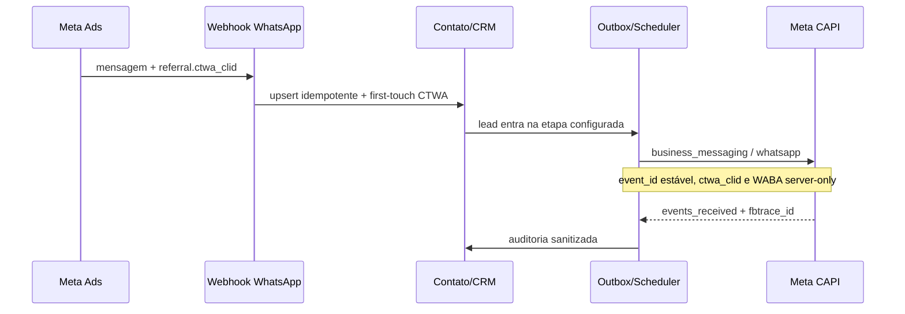

# Engenharia reversa Anima CTWA Manager — incorporação no Wal Chat

## Escopo

O repositório `lucasblante/Anima-CTWA-Manager`, revisão `0cd15c6`, foi clonado
localmente e analisado como referência funcional. Como ele não declara uma
licença de reutilização, nenhum código foi copiado literalmente. Os conceitos
úteis foram reimplementados sobre a arquitetura multi-tenant, a outbox e os
controles de segurança já existentes no Wal Chat.

## Conhecimento aproveitado

| Conceito do sistema de referência                             | Implementação independente no Wal Chat                                     |
| ------------------------------------------------------------- | -------------------------------------------------------------------------- |
| Captura de `referral.ctwa_clid` no webhook WhatsApp           | Normalização defensiva no processador oficial do canal                     |
| Vínculo do clique com o lead                                  | Atribuição permanente no contato, herdada pelo lead vinculado              |
| Preservação do primeiro clique                                | Trigger de banco e upsert server-only impedem sobrescrita                  |
| Contexto do anúncio                                           | ID, URL sanitizada, tipo, headline, body e mídia aparecem no drawer do CRM |
| Eventos `Lead`, `LeadSubmitted`, `QualifiedLead` e `Purchase` | Nome configurável por regra de etapa do pipeline                           |
| CAPI para Business Messaging                                  | `business_messaging` + `whatsapp` + `ctwa_clid` + WABA                     |
| ID estável para deduplicação                                  | UUID durável de `ad_conversion_events`, reutilizado nos retries            |
| Identificador da compra                                       | O UUID durável também preenche `custom_data.order_id` em `Purchase`        |
| Auditoria de envio                                            | Entregas sanitizadas com status HTTP, request ID e código estável          |

## Melhorias sobre a referência

O Wal Chat não adotou os seguintes padrões observados no repositório:

- envio CAPI síncrono durante a mudança de etapa: a conversão entra em outbox e
  o scheduler executa com retry e backoff, sem fragilizar a transação do CRM;
- endpoint de simulação sem autenticação: testes permanecem autenticados e não
  fabricam sucesso de produção;
- “sandbox” que marca evento como enviado sem credencial: conexão pendente ou
  dados ausentes produzem estado explícito de erro/bloqueio;
- `event_id` baseado em relógio: o UUID persistido mantém deduplicação real em
  redelivery e replay;
- usuário/senha padrão: o Wal Chat usa Supabase Auth, membership e papel do
  workspace;
- armazenamento sem isolamento: todas as consultas validam `workspace_id` e as
  tabelas de atribuição continuam inacessíveis a `anon` e `authenticated`;
- exposição do click ID na interface: o CRM recebe apenas um indicador de
  presença e o contexto seguro do anúncio.

## Fluxo final



## Dados persistidos

`contact_ad_attributions` passa a guardar:

- `ctwa_clid` e `ctwa_waba_id`, restritos ao backend;
- `ctwa_source_id`, `ctwa_source_url` e `ctwa_source_type`;
- `ctwa_headline`, `ctwa_body` e `ctwa_media_type`;
- `ctwa_received_at`.

Os limites são aplicados em TypeScript e no PostgreSQL. URLs aceitam somente
HTTP/HTTPS, têm credenciais, fragmento e query removidos antes da persistência.

## Contrato CAPI CTWA

Quando a regra usa a origem **WhatsApp — anúncio CTWA**, o evento Meta é:

```json
{
  "event_name": "QualifiedLead",
  "event_time": 1788611400,
  "event_id": "uuid-estavel-da-outbox",
  "action_source": "business_messaging",
  "messaging_channel": "whatsapp",
  "user_data": {
    "ctwa_clid": "valor-original-do-webhook",
    "whatsapp_business_account_id": "waba-que-recebeu-a-mensagem"
  }
}
```

Nesse modo, o Wal Chat não mistura e-mail, telefone, `external_id`, `fbc` ou
`fbp` no `user_data`. Se click ID ou WABA estiver ausente, o envio é bloqueado
com `meta_ctwa_attribution_missing`; ele não cai silenciosamente para evento de
website.

## Operação

1. Aplique `20260905113000_ctwa_attribution.sql`.
2. Conecte a conta WhatsApp e confirme o webhook `messages`.
3. Conecte o dataset Meta CAPI em **Integrações → Conversões Ads**.
4. Crie uma regra Meta para a etapa desejada.
5. Selecione **WhatsApp — anúncio CTWA** como origem.
6. Mantenha a exigência de consentimento conforme a base legal definida.
7. Envie uma mensagem real originada de anúncio CTWA.
8. Abra o lead no CRM e confirme o card **Origem Meta**.
9. Mova o lead para a etapa e acompanhe o evento na fila e no Events Manager.

## Arquivos principais

- `src/server/whatsapp-webhook-processor.server.ts`
- `src/lib/ad-attribution.ts`
- `src/server/ad-attribution.server.ts`
- `src/server/ad-conversions.server.ts`
- `src/components/conversion-tracking-panel.tsx`
- `src/routes/api/crm/$leadId.ts`
- `supabase/migrations/20260905113000_ctwa_attribution.sql`

## Limites atuais

- enriquecimento com nome de campanha/ad set pela Marketing API não foi
  habilitado: exige permissão e token adicionais e não é necessário para a
  atribuição CAPI; o ID e o criativo recebidos no webhook continuam disponíveis;
- a validade real do `ctwa_clid` e o vínculo dataset/WABA só podem ser
  homologados com uma mensagem originada de anúncio e credenciais Meta reais;
- a mudança foi implementada localmente; promoção para produção exige migration,
  backup, smoke test e rollback aprovado.
