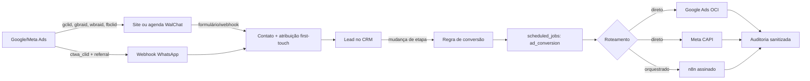

# Rastreamento de conversões offline — Google Ads OCI e Meta CAPI

## Objetivo e escopo

Este módulo fecha o ciclo entre origem publicitária, contato, oportunidade e
plataformas de mídia. O WalChat captura os identificadores do clique, preserva a
atribuição no contato e, quando o lead entra em uma etapa configurada, enfileira
uma conversão para Google Ads, Meta ou n8n.

A implementação é multi-tenant, idempotente e assíncrona. Nenhuma chamada às
plataformas acontece dentro da transação que movimenta o lead.



## Componentes implementados

| Camada           | Implementação                                                                                          |
| ---------------- | ------------------------------------------------------------------------------------------------------ |
| Captura web      | `src/lib/ad-attribution.ts` lê parâmetros, cookies `_fbc`/`_fbp`, UTMs, URL, referrer e user-agent.    |
| Agenda pública   | `/agendar/$slug` captura a origem e pede consentimento específico para mensuração.                     |
| Webhook de leads | `/api/public/webhooks/leads/$token` aceita campos flat ou um objeto `tracking`/`attribution`.          |
| WhatsApp CTWA    | O webhook captura click ID, WABA e contexto do anúncio sem expor o identificador no CRM.               |
| Persistência     | `contact_ad_attributions` mantém click IDs first-touch e atualiza UTMs do último toque por 90 dias.    |
| Regras           | `ad_conversion_rules` mapeia uma etapa do CRM para Google, Meta, valor e consentimento.                |
| Outbox           | `ad_conversion_events` possui unicidade `(rule_id, lead_id)`.                                          |
| Fila             | `scheduled_jobs.kind = ad_conversion`, com lock `SKIP LOCKED`, cinco tentativas e backoff exponencial. |
| Entrega          | `src/server/ad-conversions.server.ts` gera e envia contratos Google/Meta ou `conversion.ready` ao n8n. |
| Operação         | Integrações → Conversões Ads configura, valida, cria regras, monitora e reenfileira falhas.            |

## Dados capturados

Campos aceitos em camelCase e snake_case:

```json
{
  "gclid": "...",
  "gbraid": "...",
  "wbraid": "...",
  "fbclid": "...",
  "fbc": "fb.1....",
  "fbp": "fb.1....",
  "ctwa_clid": "...",
  "ctwa_source_id": "120212345678901234",
  "ctwa_source_url": "https://facebook.com/...",
  "ctwa_source_type": "ad",
  "ctwa_headline": "Oferta do anúncio",
  "ctwa_media_type": "image",
  "ctwa_waba_id": "123456789012345",
  "utm_source": "google",
  "utm_medium": "cpc",
  "utm_campaign": "campanha",
  "utm_content": "criativo-a",
  "utm_term": "palavra-chave",
  "landing_url": "https://site.example/oferta",
  "referrer_url": "https://google.com/",
  "client_user_agent": "...",
  "ad_user_data_consent": "granted",
  "captured_at": "2026-09-02T12:00:00.000Z"
}
```

Regras importantes:

- `gclid`, `gbraid`, `wbraid`, `fbclid`, `fbc` e `fbp` são first-touch: um
  clique posterior não substitui a origem já ligada ao contato;
- `ctwa_clid`, WABA e o contexto do primeiro referral também são first-touch;
- UTMs, página e referrer refletem o toque mais recente;
- o prazo de retenção operacional é renovado para 90 dias;
- IP bruto não é coletado nem persistido;
- os identificadores de clique são removidos do payload de diagnóstico do
  webhook e ficam apenas na tabela restrita de atribuição;
- a API privada nunca devolve tokens nem click IDs ao navegador.

### Click-to-WhatsApp

Quando a primeira mensagem veio de um anúncio para WhatsApp, a Meta inclui um
objeto `referral` no webhook. O Wal Chat salva o `ctwa_clid`, a WABA receptora e
o contexto do anúncio no contato. O drawer do lead mostra origem, ID do anúncio,
criativo e horário, mas nunca devolve o click ID completo ao frontend.

Para devolver a conversão, selecione **WhatsApp — anúncio CTWA** na origem Meta
da regra. O payload passa a usar `action_source=business_messaging`,
`messaging_channel=whatsapp`, `user_data.ctwa_clid` e
`user_data.whatsapp_business_account_id`. Click ID ou WABA ausente bloqueia a
entrega com `meta_ctwa_attribution_missing`.

## Formulários externos e GTM

Crie campos ocultos com estes nomes:

`gclid`, `gbraid`, `wbraid`, `fbclid`, `fbc`, `fbp`, `utm_source`,
`utm_medium`, `utm_campaign`, `utm_content`, `utm_term`, `landing_url`,
`referrer_url`, `client_user_agent`, `ad_user_data_consent`, `captured_at`.

O painel Integrações → Conversões Ads oferece um snippet copiável para preencher
esses campos. O CMP do site deve alterar `ad_user_data_consent` para `granted`
somente depois da escolha válida do visitante. O valor inicial é `unknown`.

O formulário envia os campos para a fonte já existente:

```text
POST /api/public/webhooks/leads/{token-da-fonte}
Content-Type: application/json
```

Também é aceito um objeto aninhado `tracking` ou `attribution`. O corpo máximo
continua limitado a 64 KiB e a deduplicação é feita pelo hash do corpo.

## Configuração do Google Ads OCI

Pré-requisitos da plataforma WalChat:

```dotenv
GOOGLE_CLIENT_ID=cliente-oauth.apps.googleusercontent.com
GOOGLE_CLIENT_SECRET=segredo
GOOGLE_OAUTH_REDIRECT_URI=https://seu-dominio/api/integrations/google/callback
CREDENTIALS_ENCRYPTION_KEY=chave-de-32-bytes-ou-mais
```

No Google Ads:

1. Ative a codificação automática.
2. Crie uma ação de conversão importada, do tipo upload de cliques.
3. Anote o ID numérico da ação, o Customer ID e, se aplicável, o Manager ID.
4. Solicite/obtenha o Developer Token na conta gerente.
5. No WalChat, abra Integrações → Conversões Ads.
6. Autorize a conta Google. O fluxo usa state de uso único, PKCE, cookie
   `HttpOnly`, `SameSite=Lax`, escopo `adwords` e refresh token cifrado.
7. Salve Customer ID sem hífens, Manager ID e Developer Token.
8. Clique em Testar. O teste executa uma consulta mínima `customer.id`; ele não
   cria conversão.

O envio usa `UploadClickConversions` com `partialFailure=true`, um único click ID
na ordem `gclid`, `wbraid`, `gbraid`, `orderId` igual ao UUID do evento e
`adUserData=GRANTED`. E-mail e telefone são normalizados e recebem SHA-256 no
servidor imediatamente antes do envio.

## Configuração da Meta CAPI

1. No Events Manager, localize o ID do dataset/pixel.
2. Gere um token de usuário do sistema com acesso ao dataset.
3. Informe dataset/pixel e token no WalChat.
4. Opcionalmente ative o Test Event Code apenas durante homologação.
5. Salve e clique em Testar. O teste consulta somente `id,name` do dataset.
6. Antes de produção, desative “Manter modo de teste ativo” e salve novamente.

O evento usa `event_id` estável, `action_source` da regra, `event_source_url`
quando a origem é `website`, `fbc`/`fbp` sem hash e e-mail, telefone e
`external_id` com SHA-256. Para CTWA, usa o contrato Business Messaging descrito
acima e não mistura identificadores web. Eventos `Purchase` usam o UUID durável
também como `custom_data.order_id`. O WalChat não envia IP bruto.

## Regras por etapa do CRM

Uma regra define:

- etapa que dispara o evento;
- provedor(es);
- ID da ação do Google e/ou nome do evento Meta;
- origem Meta (`system_generated`, `website`, `business_messaging`,
  `phone_call`, etc.);
- valor da oportunidade, valor fixo ou nenhum valor;
- moeda;
- exigência de consentimento;
- estado ativo/pausado.

O gatilho ocorre somente quando o lead entra na etapa depois que a regra existe.
Não há backfill automático. Revisitar a mesma etapa não cria outra conversão
para a mesma regra e lead. Para um novo marco, use outra etapa/regra.

## Consentimento e LGPD

Por padrão, a regra exige consentimento. O worker aceita:

- `contact_ad_attributions.ad_user_data_consent = granted`; ou
- `contacts.marketing_consent = granted`.

Sem uma dessas evidências, o evento termina como `blocked` com o código
`ad_user_data_consent_required` e não chama Google, Meta ou n8n. O operador pode
corrigir o consentimento e usar Reenviar. Desativar o requisito é uma decisão do
controlador e deve estar amparada pela base legal aplicável.

## Modo n8n

Cada provedor pode usar roteamento `n8n`. Nesse modo, o WalChat:

1. constrói o mesmo objeto já normalizado e com PII em SHA-256;
2. envia `conversion.ready` pelo conector n8n existente;
3. assina os bytes com HMAC-SHA256;
4. inclui timestamp, delivery ID estável e proteção anti-replay;
5. registra somente hash e metadados sanitizados da entrega.

Contrato resumido:

```json
{
  "schemaVersion": 1,
  "provider": "google_ads",
  "accountId": "1234567890",
  "data": {
    "conversionAction": "customers/.../conversionActions/...",
    "orderId": "uuid-estavel"
  }
}
```

No workflow n8n, use Webhook → Switch por `provider` → HTTP Request Google/Meta
→ tratamento explícito de 429/5xx → Error Workflow. Credenciais das plataformas
devem permanecer no Credential Store do n8n. Não há JSON importável versionado
porque o repositório não fixa uma versão exata do n8n; exporte o workflow real da
instância após homologação.

## Estados, retries e operação

| Estado       | Significado                                        | Ação                                   |
| ------------ | -------------------------------------------------- | -------------------------------------- |
| `pending`    | aguardando ou retry transitório                    | aguardar o scheduler                   |
| `processing` | reservado pelo worker                              | observar heartbeat se ficar preso      |
| `completed`  | todos os provedores aceitaram                      | nenhuma                                |
| `partial`    | um provedor aceitou e outro falhou permanentemente | corrigir e reenviar                    |
| `failed`     | nenhum provedor aceitou                            | corrigir configuração/dados e reenviar |
| `blocked`    | consentimento ou dados obrigatórios ausentes       | corrigir a causa e reenviar            |

Falhas de rede, timeout, HTTP 429 e 5xx recebem até cinco tentativas com backoff.
Erros de contrato/credencial 4xx terminam sem queimar retries. Em uma repetição,
provedores já concluídos não são enviados novamente.

As tabelas de entrega guardam status HTTP, request ID do Google ou `fbtrace_id`
da Meta, código estável e contagem aceita. Respostas completas, tokens, e-mail,
telefone e click IDs não entram nos logs.

## APIs privadas

| Método e rota                                                  | Uso                                                     |
| -------------------------------------------------------------- | ------------------------------------------------------- |
| `GET /api/integrations/conversions/status`                     | conexões sanitizadas, etapas, regras e eventos recentes |
| `PUT /api/integrations/conversions/configure`                  | salvar Google/Meta e secrets cifrados                   |
| `POST /api/integrations/conversions/google/start`              | iniciar OAuth Google Ads                                |
| `POST /api/integrations/conversions/test`                      | validar provedor sem conversão real                     |
| `DELETE /api/integrations/conversions/disconnect?provider=...` | revogar estado local e apagar secrets                   |
| `POST /api/integrations/conversions/rules`                     | criar, atualizar ou excluir regra                       |
| `POST /api/integrations/conversions/replay`                    | reenfileirar evento terminal                            |

Todas exigem Bearer válido e membership do workspace. Mutações exigem
owner/admin, origem confiável e, nos endpoints sensíveis, rate limit.

## Homologação e virada de chave

1. Aplique a migration e reinicie aplicação + scheduler.
2. Conecte e teste cada provedor.
3. Use Test Event Code da Meta durante a homologação.
4. Crie uma etapa de teste e uma regra com valor baixo.
5. Capture um lead real com consentimento e click ID válido.
6. Mova o lead para a etapa e acompanhe o evento no painel.
7. Confirme a recepção nas interfaces Google/Meta.
8. Remova o Test Event Code.
9. Mantenha a ação offline como secundária por 14–30 dias.
10. Com volume e qualidade suficientes, promova o marco qualificado/venda para
    primário conforme a estratégia de mídia.

## Rollback

- Pause as regras (`is_active=false`) para cessar novos eventos imediatamente.
- Desconecte cada provedor para apagar credenciais cifradas.
- Pare o scheduler somente se outras automações puderem ficar indisponíveis.
- Não apague eventos durante incidente; eles são a trilha de reconciliação.
- Reenvie apenas depois de corrigir a causa. O UUID/event ID permanece o mesmo.

## Validação automatizada

```bash
npx tsc --noEmit
npx vitest run src/lib/ad-attribution.test.ts src/server/ad-conversions.test.ts
npm test
npm run build
```

Os testes cobrem captura e limites de entrada, normalização/hashing, ausência de
PII bruta nos contratos, prioridade do click ID, payload Meta, regras e o evento
`conversion.ready` do n8n.
