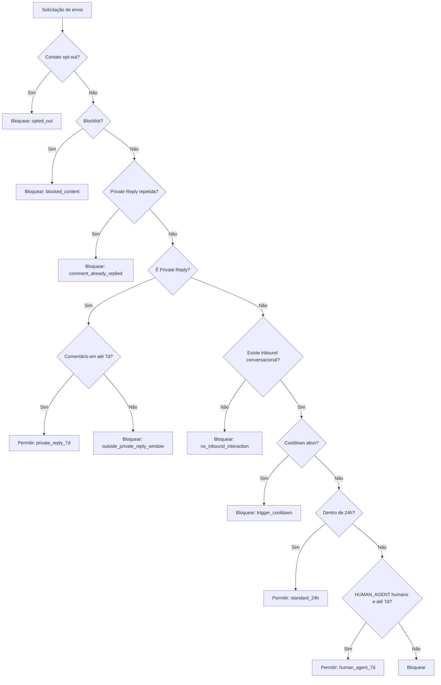

# Segurança e compliance

## 1. Controles implementados

| Risco                              | Controle                                                  |
| ---------------------------------- | --------------------------------------------------------- |
| Webhook forjado                    | HMAC SHA-256 e comparação constant-time                   |
| Evento duplicado                   | Hash do corpo, `jobId` e índices únicos                   |
| Vazamento entre tenants            | RLS por `workspace_id`                                    |
| Vazamento de tokens                | AES-256-GCM, service role only e sem prefixo `VITE_`      |
| Spam por gatilho                   | Cooldown por contato/gatilho                              |
| Automação fora da janela           | Revalidação imediatamente antes do envio                  |
| Abuso de `HUMAN_AGENT`             | Automação bloqueada; somente fluxo humano                 |
| Opt-out ignorado                   | `opted_out_at` bloqueia qualquer envio                    |
| Private Reply duplicada            | Chave única por comentário                                |
| DM duplicada após timeout          | Claim persistente e estado `unknown` sem retry automático |
| Evento persistido fora da fila     | Reconciliação Postgres/BullMQ pelo `jobId` canônico       |
| Conteúdo proibido                  | Blocklist antes do envio                                  |
| Abuso de endpoints sensíveis       | Rate limit por classe de rota no Nginx                    |
| Dependência externa travada        | Timeout de 15 s Meta e 45 s IA; erro sanitizado           |
| Processo privilegiado no container | Usuário não-root, caps removidas e filesystem read-only   |

## 2. Ordem de decisão do compliance

Mensagens automáticas recebem `Responda PARAR` antes da avaliação de conteúdo e antes da chamada à Meta.

## 3. Secrets

Nunca versionar:

- `.env.local` ou `.env.production`;
- `SUPABASE_SERVICE_ROLE_KEY`;
- `META_APP_SECRET`, access tokens ou publish tokens;
- `GOOGLE_GENERATIVE_AI_API_KEY`;
- `OPENAI_API_KEY`, `OPENAI_PROJECT` e `CREDENTIALS_ENCRYPTION_KEY`;
- dumps, `status.env`, chaves SSH ou logs contendo credenciais.

Regras operacionais:

1. Uma credencial por ambiente.
2. Privilégio mínimo e rotação periódica.
3. Tokens e API keys de cada tenant cifrados em `integration_credentials`, sem GRANT para `anon/authenticated`.
4. Revogação imediata após desligamento do cliente.
5. Nunca expor secrets em screenshots, issues ou PRs.

## 4. Superfície HTTP

- Nginx publica somente 80/443.
- App e serviços de dados usam portas internas ou bloqueadas pela rede do provedor.
- Webhook e callback de exclusão são públicos porque a Meta precisa acessá-los.
- Endpoints privados de integração, IA e envio exigem JWT e papel do workspace.
- O Nginx versionado limita tráfego geral, webhook, início OAuth e envio/IA com budgets diferentes; o `429` inclui `Retry-After`.
- O rate limit é por instância Nginx. Escala horizontal exige borda compartilhada ou gateway distribuído.
- Respostas de erro não retornam detalhes de stack.
- Health check informa presença de configuração, não valores.

## 5. Checklist antes do Live Mode

- [ ] Verificação empresarial concluída.
- [ ] App Review e Advanced Access aprovados.
- [x] OAuth por workspace implementado no backend.
- [x] Tokens cifrados por tenant e sender sem fallback global em live.
- [ ] OAuth testado com App ID/secret e conta Professional reais.
- [ ] Rotação operacional ensaiada.
- [ ] `DEMO_MODE=false` somente no ambiente correto.
- [ ] SMTP, confirmação e recuperação de senha ativos.
- [x] Rate limiting versionado no proxy para endpoints gerais e sensíveis.
- [ ] Rate limiting validado no domínio final e monitorado em produção.
- [ ] Política de Privacidade, Termos e Exclusão publicados em HTTPS.
- [ ] Processo real de exclusão e retenção de dados testado.
- [ ] Alertas de fila falha, erro Meta e jobs atrasados.
- [ ] Backups e restauração comprovados.
- [ ] Contatos de suporte e incidente definidos.

## 6. Resposta a incidentes

1. Pausar campanhas e manter `DEMO_MODE=true` se houver risco de envio indevido.
2. Revogar tokens afetados no Meta Business e no provedor de IA.
3. Preservar logs sem copiar conteúdo sensível para canais públicos.
4. Identificar workspaces, contatos e período impactados.
5. Corrigir, testar compliance e reprocessar somente eventos idempotentes.
6. Notificar titulares conforme LGPD e política interna.

## 7. Limitações atuais relevantes

- O OAuth multi-tenant está implementado, mas não pode ser validado externamente sem o app e a conta Professional reais.
- O callback de exclusão gera protocolo, mas precisa de job de eliminação definitiva.
- A configuração de rate limiting existe no repositório, mas ainda precisa de validação no proxy/domínio final.
- Entregas em estado `unknown` precisam de uma fila operacional com consulta no Meta Business antes de qualquer nova tentativa.
- O preview puro de compliance é público e não realiza efeitos; integrações, IA persistida e envio são autenticados.

Esses limites ficam deliberadamente visíveis; não devem ser tratados como produção concluída.
